[< voltar](./README.md)

<h1 align='center'>Curso Formação DEV</h1>

***Este conteúdo faz parte do curso de Formação DEV da [COD3R](https://www.cod3r.com.br)***

<h1 align='center'>GAM3R STORE  e-Commerce Simples</h1>

## Criação do Projeto  

Dentro do diretório onde deseja criar o projeto ***"C:\Projetos\ecommerce"*** por exemplo, crie um diretório chamado `\mercado` e dentro desse diretório abra o Terminal e execute o comando a seguir:  

```zsh
// Terminal

$ npx create-next-app@latest frontend
```

Após criar o projeto, instale a dependência [Tabler](https://tabler.io/docs/icons/react#installation) para React que é o pacote de ícones que iremos utilizar no projeto.  
Se houver algum problema na instalação do Tabler, pode ser que o `react:` e o `react-dom:` no `package.json` estejam na versão RC Release Candidate e não sejam compatíveis com o Tabler, a solução é modificar manualmente para uma versão estável, neste momento estamos utilizando a versão 18.3.1.  

```json
// package.json

...
  "dependencies": {
    "@tabler/icons-react": "^3.21.0",
    "next": "15.0.2",
    "react": "^18.3.1",
    "react-dom": "^18.3.1"
...
```

O próximo passo é iniciar o projeto para que possamos visualizar as alterações feitas instantaneamente, para isso execute o comando a seguir no Terminal.  

```zsh
// Terminal

$ npm run dev
```

Com isso teremos o projeto de modelo do React sendo executado no navegador através do endereço [localhost:3000](http://localhost:3000) apresentando a seguinte página:  

<div align='center'></div>

[^ Sumário ^](./README.md)

## Limpando a Estrutura Padrão  

Agora precisamos excluir alguns arquivos e trechos de código que não iremos utilizar em nosso projeto.  

- Primeiro precisamos excluir todo o conteúdo da página principal do projeto que se encontra no caminho `src\app\page.tsx`.  

```tsx
// page.tsx

export default function Home() {
  return (
    <div className="flex justify-center pt-10">Aplicação</div>
  );
}
```

Após a edição do arquivo, ele apresentará no navegador a mensagem ***"Aplicação"*** centralizada na tela.  
O próximo passo é editar o arquivo `layout.tsx` que se encontra no caminho `src\app\layout.tsx`.  

```tsx
// layout.tsx

import type { Metadata } from "next";
import {Montserrat} from "next/font/google"
import "./globals.css";

const font = Montserrat({
  subsets: ['latin']
})

export const metadata: Metadata = {
  title: "GAM3R STORE",
  description: "Versão completa da loja Gam3r.Store",
};

export default function RootLayout({
  children,
}: Readonly<{
  children: React.ReactNode;
}>) {
  return (
    <html lang="pt-BR">
      <body className={font.className}>
        {children}
      </body>
    </html>
  );
}

```

Com isso, fizemos as seguintes alterações:

- Importamos a fonte Montserrat do google.  

  ```tsx
  import {Montserrat} from "next/font/google"
  ```  

- Criamos uma contrante chamada "font" para ser utilizada no body.

  ```tsx
  const font = Montserrat({subsets: ['latin']})
  ```  

- Inserimos a contante "font" no "className" do body.  

  ```html
  <body className={font.className}>
  ```

- Alteramos o idioma da página para português Brasil.  

  ```html
  <html lang="pt-BR">
  ```  

- E por último, modificamos o título e a descrição da página.  

  ```tsx
  export const metadata: Metadata = {
    title: "GAM3R STORE",
    description: "Versão completa da loja Gam3r.Store",
  };
  ```

Com essas alterações, já podemos excluir o diretório `\fonts`que se encontra no caminho `src\app` e todo o conteúdo do diretório `\public` que se encontra na raiz da aplicação Frontend.  

>***OBS.:***  
É para excluir o que tem dentro do diretório e não o diretório, a pasta deve continuar na raiz do projeto.

[^ Sumário ^](./README.md)

## Criando o Núcleo da Aplicação

Agora iremos criar o diretório onde iremos criar a ***Regra de Negócio da Aplicação***, neste diretório não será misturado com nenhuma linguagem de framework, aqui iremos utilizar lógica de programação pura, não será desenhado nenhuma tela e nem será feito nenhuma conexão com Banco de Dados ou APIs.  
E é por isso que precisamos aprender a separar o que é Regra de Negócio de frameworks e bibliotecas, para que possamos proteger as Regas de eventuais mudanças que os Frameworks acabam impondo para aqueles que se comprometem demais os utilizando.  
Para isso, no caminho `\src` crie um diretório chamado `\core`, por enquanto ele ficará dentro do Frontend, mas, posteriormente ele será retirado para que fique fora da estrutura do Frontend.  
A Lógica implementada dentro do Core, ficará disponível para toda a aplicação, podendo ser usada tanto no ***Frontend quanto no Backend*** e por outras tecnologias, por isso a importância de se separar a ***Regra de Negócio***.  

Dentro do diretório Core, nenhum arquivo será acessado diretamente, todos os arquivos serão exportados e acessados através do arquivo ***"index.ts"*** que se encontra no caminho `\src\core\index.ts`.  

No ***Core da Aplicação*** iremos definir algumas coisas importantes, principalmente na parte de ***PRODUTOS.***  
No momento nosso foco inicial será ***Página Inicial*** e na página de ***Detalhes de Produtos***, onde constarão as definições do produto, preço com e sem desconto, preço parcelado, botões de comprar e adicionar no carrinho entre outras informações.

[^ Sumário ^](./README.md)

## PRODUTO

### Interface Produto

Estaremos utilizando a abordagem de modelagem por ***interface*** por simplicidade, pois, se optasse-mos por DDD, Arquitetura Limpa e outros padrões que iriam influenciar muito a arquitetura, seria utilizado a abordagem de se criar uma Classe ao invés de uma interface.  
Por isso, vamos focar em uma modelagem mais simples ***"anêmica"***, para poder focar em outras questões da Aplicação, pois, existe muita coisa para ser feita.  

>*Mas aqui seria uma oportunidade de se criar um **Modelo Rico** colocando Regas de Negócio dentro das Entidades, pois, quando as Regras estão no Centro da Aplicação, com as Regras próximas dos DADOS, se favorece uma melhor **Orientação a Objetos.***  
>
>*Pois a **POO** (Programação Orientada a Objetos), diz respeito a Atributos mas também a Comportamentos relacionados aqueles atributos, então, se existem Regras o ideal é que elas andem juntos com os atributos do Objeto, dentro da Classe que está sendo implementada.*
<p>

No caminho `\src\core` crie um novo diretório chamado `\produto` e dentro dele crie um arquivo chamado `Produto.ts` é nesse arquivo que iteremos implementar nossa ***Interface de Produto***, onde iremos definir os atributos do produto.  

```ts
// Produto.ts

export default interface Produto {
  id: number
  nome: string
  descricao: string
  marca: string
  modelo: string
  imagem: string
  nota: number
  videoReview: string
  tags: string[]
}
```

> [!IMPORTANT]
> Não planeje o reuso antes do uso, quero dizer que, não tente criar uma Mega Arquitetura antes de ter a necessidade para aquela Mega Arquitetura, para que não se frustre e desista no meio do caminho.  
>Comece simples e vá evoluindo e implementando conforme o necessário.

[^ Sumário ^](./README.md)

### Interface Especificações

Agora estaremos implementando as Especificações do Produto.
No caminho `\src\core` crie o arquivo chamado `Especificacoes.ts`, esse arquivo tem uma particularidade, pois, diversos produtos possuem especificações diferentes uns dos outros e isso dificulta um pouco na criação dessa Interface, mas existe uma forma de informar essas especificações de uma forma mais flexível.  
Uma coisa é certa, todas as especificações dos produtos e uma delas está em destaque.  

```ts
// Especificacoes.ts

export default interface Especificacoes {
  destaque: string
  //* Faz com que o atributo chave: valor seja flexível
  [chave: string]: string | number | boolean
}
```

Interface Produto atualizada com a adição do atributo especificacoes.

```ts
// Produto.ts

import Especificacoes from "./Especificacoes"

export default interface Produto {
  id: number
  nome: string
  descricao: string
  marca: string
  modelo: string
  imagem: string
  nota: number
  videoReview: string
  tags: string[]
  especificacoes: Especificacoes
}
```

>#### Relação Composição
>
>Quando **TEM UM** Produto **E TEM** Especificações (relação "TEM UM")*
<p>

[^ Sumário ^](./README.md)

### Interface Precificavel

Agora iremos implementar a interface precificavel, isso significa que implementaremos algo que pode ser precificavel.  

No caminho `\src\core` crie o arquivo chamado `Precificavel.ts`, contendo os atributos abaixo.  

```ts
// Precificavel.ts

export default interface Precificavel {
  menorPreco: number
  maiorPreco: number
  precoBase: number
  precoMedio: number
  precoPromocional: number
}
```

A maioria dos programadores gosta de padronizar o nome das variáveis como no caso acima muitos iriam preferir usar o sufixo "preco" em todos os atributos, mas, prefiro particularmente usar variáveis como falamos normalmente, assim fica melhor para identificar sobre o que se trata, utilizando palavras que são usadas regularmente no negócio, evitando assim estranheza por parte de quem vai usar o sistema.  

Pois o código deve refletir ao máximo o negócio, e não ficar usando jargões de tecnologia, dificultando a comunicação entre o corpo técnico e os membros do negócio.  

[^ Sumário ^](./README.md)

### Relação de Herança

Agora iremos implementar uma Relação de Herança na interface Produto, pois, além do produto ter especificações, ele também é precificavel e para estabelecer essa relação, vamos estender a interface produto da interface precificavel, pode parecer difícil, mas é muito simples como podemos ver a seguir.  

```ts
// Produto.ts

import Especificacoes from "./Especificacoes"
import Precificavel from "./Precificavel"

export default interface Produto extends Precificavel {
  id: number
  nome: string
  descricao: string
  marca: string
  modelo: string
  imagem: string
  nota: number
  videoReview: string
  tags: string[]
  especificacoes: Especificacoes
}
```

Neste caso não seria necessário utilizar a Herança, mas foi utilizado para exemplo, pois poderíamos colocar os atributos diretamente na interface Produto.  
A herança seria mais indicado caso existissem outras Entidades que também fossem precificáveis, assim evitaria a duplicação de código desnecessária.  

[^ Sumário ^](./README.md)

### Exportando as Interfaces do Diretório Produto

Agora iremos criar e configurar o arquivo `index.ts` do diretório ***Produto*** presente no caminho `src\core\produto`, nesse arquivo, iremos importar todas as interfaces que implementamos até o momento.  

```ts
// produto\index.ts

import Especificacoes from "./Especificacoes"
import Precificavel from "./Precificavel"
import Produto from "./Produto"

export type {Especificacoes, Precificavel, Produto}
```

Como podemos ver acima, primeiro importamos cada interface utilizando o comando `import` e logo em seguida exportamos as interfaces utilizando o comando `export` seguido de `type`, precisamos utilizar o comando `type` por estarmos exportando uma ***interface*** e não uma ***Classe***.

Agora, por qual motivo que foi criado esse arquivo `index.ts` dentro do diretório Produto?  

Esse arquivo foi criado para que possamos expor todo o conteúdo de Produto para toda a aplicação, mas só criar esse arquivo importando e exportando as interfaces não faz a mágica acontecer, pra isso acontecer verdadeiramente, precisamos criar outro arquivo `index.ts` dentro do diretório Core exportando todo o conteúdo de Produto.  

Esse mesmo processo precisa ser feito em todos os diretórios e arquivos que pretendemos utilizar fora do Núcleo da Aplicação, consequentemente utiliza-los em toda a aplicação.  

Então, vamos criar e configurar o `index.ts` do Core, no caminho `src\core`.

```ts
// core\index.ts

export * from "./produto"
```

Como podemos ver acima, estamos exportando `export` tudo `*` de `from` Produto `"./produto`, esse mesmo procedimento deve ser feito para outros diretórios que pretendemos expor para toda a Aplicação.

[^ Sumário ^](./README.md)

## PARCELAMENTO

No Parcelamento, iremos definir qual é a estrutura de um parcelamento juntamente com o cálculo relacionado a juros compostos (tendo um preço promocional dividido por uma quantidade de parcelas) mostrando qual o valor das parcelas.  
Esta Regra do Negócio continua separada de tecnologias e puramente pertencente ao Núcleo da Aplicação.  

O Parcelamento não estará relacionado ao produto e nem ao pedido, pois, o parcelamento pode ser usado em várias partes da Aplicação.

[^ Sumário ^](./README.md)

### Interface Parcelamento

Agora no caminho `src\core` crie um diretório chamado `parcelamento` e dentro dele crie o arquivo `Parcelamento.ts` que será nossa interface.  

Vamos implementar um interface simples contendo os atributos: valorTotal (que servirá como base para o calculo), valorParcela, qtdeParcelas e taxaJuros.

```ts
// Parcelamento.ts

export default interface Parcelamento {
  valorTotal: number
  valorParcela: number
  qtdeParcelas: number
  taxaJuros: number
}
```

[^ Sumário ^](./README.md)

### Classe Calcular Parcelamento

Agora iremos criar uma Classe que irá implementar o cálculo relacionado ao parcelamento.  

> [!NOTE]
> Esse cálculo, ele é algo que representa a Regra de Negócio da Aplicação e isso não deveria estar ***"amarrado ou atrelado"*** ao Backend, pois, as Regras precisam utilizar apenas a linguagem de programação e dependendo o mínimo possível de Framework, assim se isola a Regra e podemos reusar em qualquer lugar, até mesmo em outra aplicação semelhante.  

<p>

Antes de qualquer coisa precisamos criar o arquivo `index.ts` no diretório chamado `\constants` no caminho `src\core` que irá conter as constantes que iremos precisar usar em nossa ***Classe Calcular Parcelamento***.  

```ts
// constants\index.ts

const QTDE_MAX_PARCELAS = 12
const TAXA_JUROS_MENSAL = 0.0167

export { QTDE_MAX_PARCELAS, TAXA_JUROS_MENSAL }
```

Como podemos ver acima, criamos duas constantes, uma referente a ***quantidade de parcelas*** e a outra referente a ***taxa de juros*** e logo em seguida exportamos as duas constantes para que possamos usar na aplicação.  

Agora que já temos nossas constantes criadas, podemos começar a implementar nossa Classe.  
No caminho `src\core\parcelamento` crie o arquivo `CalcularParcelamento.ts` que será nossa Classe.

```ts
// CalcularParcelamento.ts

import { QTDE_MAX_PARCELAS, TAXA_JUROS_MENSAL } from "../constants";
import Parcelamento from "./Parcelamento";

export default class CalcularParcelamento {
  executar(
    valor: number,  //* Valor Base promocional
    qtdeParcelas: number = QTDE_MAX_PARCELAS,
    taxaJuros: number = TAXA_JUROS_MENSAL //* Pode passar uma taxa específica ou usa a taxa padrão cadastrada
  ): Parcelamento {
    if (qtdeParcelas < 2 || qtdeParcelas > QTDE_MAX_PARCELAS){
      //* Dispara uma exceção caso tem parcelar acima do permitido 
      throw new Error(`Quantidade de parcelas deve ser entre 2 e ${QTDE_MAX_PARCELAS}`)
    }

    //* Calcula o valor total do produto, junto com os juros compostos
    const totalComJuros = this.calcularJurosCompostos(valor, taxaJuros, qtdeParcelas)

    return {
      valorParcela: this.comDuasCasasDecimais(totalComJuros / qtdeParcelas),
      valorTotal: this.comDuasCasasDecimais(totalComJuros),
      qtdeParcelas,
      taxaJuros,
    }
  }

    private calcularJurosCompostos(valorTotal: number, taxaMensal: number, qtdeParcelas: number){
      //* O cálculo é o Valor Promocional, multiplicado pela formula
      //* 1 mais a taxaMensal elevado a qtdeParcelas Ex. (0.0167)¹²
      return valorTotal * Math.pow(1 + taxaMensal, qtdeParcelas)
    }

    private comDuasCasasDecimais(valor: number): number {
      return Math.round(valor * 100) / 100
    }
}
```

O próximo passo é criar o arquivo `index.ts` no diretório `\parcelamento` importando e exportando todos os arquivos constantes nele.  

```ts
// parcelamento\index.ts

import CalcularParcelamento from "./CalcularParcelamento"
import Parcelamento from "./Parcelamento"

export { CalcularParcelamento }
export type { Parcelamento }
```

E para completar o processo, precisamos atualizar o arquivo `index.ts` do diretório `\core` adicionando o diretório `\parcelamento` importando todos os seus arquivos.  

```ts
// core\index.ts

export * from "./produto"
export * from "./parcelamento"
```

[^ Sumário ^](./README.md)

## Banco de Dados Mockado

Para que possamos dar procedimento ao projeto, precisaremos mockar alguns produtos para que possamos exibir nas páginas que iremos criar.  
Posteriormente será executado um processo que irá preencher o banco de dados com essas informações.  

Então no caminho `src\core\constants` crie o arquivo `produtos.ts` e insira os dados ***(não irei colocar todos os daqui aqui pois são muitos, mas constarão no repositório).***

```ts
// produtos.ts

import { Produto } from '../produto'

const produtos: Produto[] = [
  {
    id: 1,
    nome: 'Notebook Gamer Acer Nitro 5',
    descricao:
      'O Acer Nitro 5 é um notebook gamer poderoso, ideal para jogos pesados e multitarefas.',
    marca: 'Acer',
    modelo: 'AN515-54-58CL',
    imagem:
      'https://firebasestorage.googleapis.com/v0/b/formacao-dev.appspot.com/o/lancamentos%2Fgam3rstore%2Facer-nitro-5.png?alt=media&token=094ba6a8-1a4d-414a-b32c-c176bfeaca8e',
    nota: 4.5,
    videoReview:
      'https://www.youtube.com/embed/8NQFr9De3lU?si=s_lN2KTQresD-36Y',
    tags: ['Baixou'],
    precoBase: 6499.99,
    precoPromocional: 5999.99,
    menorPreco: 4850.9,
    maiorPreco: 9800.8,
    precoMedio: 6503.7,
    especificacoes: {
      destaque: 'NVIDIA GeForce RTX 2060',
      Processador: 'Intel Core i5-9300H',
      Memória: '16GB DDR4',
      Armazenamento: '512GB SSD',
      'Placa de Vídeo': 'NVIDIA GeForce RTX 2060',
      Tela: '15.6 polegadas Full HD',
      Peso: '2.5 Kg',
    },
  },
...
]

export default Produtos
```

Agora precisamos atualizar o aquivo `index.ts` do diretório `\constants` adicionando o comando que importar e exportar o nosso Mock do Banco de Dados `produtos.ts`.

```ts
// constants\index.ts

import produtos from "./produtos"

const QTDE_MAX_PARCELAS = 12
const TAXA_JUROS_MENSAL = 0.0167

export { produtos, QTDE_MAX_PARCELAS, TAXA_JUROS_MENSAL }
```

E para finalizar, precisamos atualizar o arquivo `index.ts` no diretório Core da Aplicação `\core` exportando tudo que o diretório `\constants` contém.

```ts
// core\index.ts

export * from "./constants"
export * from "./produto"
export * from "./parcelamento"
```

[^ Sumário ^](./README.md)

## Formatando Moeda

Agora iremos criar uma Classe que irá formatar como a Moeda será exibida na tela.
No caminho `src\core` crie um diretório `\utils` e dentro crie um arquivo `Moeda.ts` que irá conter a implementação da da ***Classe Moeda.***

```ts
// Moeda.ts

export default class Moeda {
  static formatar(
    valor: number,
    localizacao: string = 'pt-BR',
    moeda: string = 'BRL'
  ): string {
    return (valor ?? 0).toLocaleString(localizacao, {
      style: 'currency',
      currency: moeda,
    })
  }
}
```

A Classe acima cria um Método estático chamado `formatar()` com os atributos: valor, localização (que por padrão seleciona o idioma ***'pt-BR'***) e moeda (que por padrão seleciona a moeda ***'BRL'***) e por fim formata a moeda.  

E essa é a Classe Utilitária que iremos utilizar em toda a Aplicação quando formos formatar qualquer moeda.  

Para finalizar, precisamos importar e exportar a Classe Moeda, no arquivo `index.ts` do diretório `\utils`.  

```ts
// utils\index.ts

import Moeda from "./Moeda"

export { Moeda }
```

E para finalizar, precisamos atualizar o `index.ts` do Core da Aplicação exportando todo o conteúdo do diretório `\utils`.

```ts
// core\index.ts

export * from "./constants"
export * from "./parcelamento"
export * from "./produto"
export * from "./utils"
```

Por enquanto o Core da Aplicação está finalizado para que possamos começar e criar a Interface Gráfica da Aplicação, mas, ainda tem bastantes funcionalidades para serem acrescentadas ao Core, mas serão adicionados futuramente.

[^ Sumário ^](./README.md)

## FRONTEND - Interface Gráfica

Agora iremos iniciar a programação da ***Interface Gráfica*** a parte visual da aplicação.  

### Componente Card ProdutoItem

Inicialmente irenos implementar o ***Item do Produto*** e para isso, vamos criar um Componente chamado ***ProdutoItem***, então, no caminho `src\app` crie um diretório `\components` depois crie outro diretório `\produto` e dentro crie o arquivo `ProdutoItem.tsx`.  

Como puderam notar, agora estamos usando a extensão ***".tsx"*** ela possui um "x" no final pois estaremos criando página Rect que mistura o ***"html"*** e o ***"css"*** na criação da interface gráfica, ou seja, um arquivo typescript possui código html e css dentro dele.

> ***NOTA:***
> ___
> *Um atalho no VSCode para criar essa estrutura mais rápido é ao invés de criar uma pasta de cada vez e depois criar o arquivo, pode clicar em criar arquivo e digitar: `components\produto\ProdutoItem.ts`.  
Assim, já são criadas as pastas e o arquivo com um único clique.  
**PS.: lembrando que para esse exemplo precisa estar dentro do** `\app`.*
<p>

Para iniciar e poder começar a visualizar algo na tela, vamos criar uma Função que irá exibir uma DIV contendo o texto ***"Produto Item"***, somente isso por enquanto.  

```tsx
// ProdutoItem.tsx

export default function ProdutoItem () {
  return (
    <div className="text-2xl border-2 border-gray-600 rounded-2xl p-4">
      Produto Item
    </div>
  )
}
```

No Componente ProdutoItem, O texto ***"Produto Item"*** será grande *(tamanho 2xl)*, estará dentro de uma div com bordas de 2 pixels de espessura, uma cor cinza escura e bordas arredondadas *(2xl)*.
O conteúdo dentro da div terá um espaçamento interno *(padding)* de 1rem *(16px)*, garantindo que o texto não fique colado nas bordas da div.  

- `text-2xl`:  
***Função:*** Define o tamanho do texto como 2xl *(extra grande)*.  
***Tamanho:*** Aproximadamente 1.5rem *(24px)* por padrão no Tailwind CSS.  
***Exemplo:*** Aumenta o tamanho da fonte do texto ***"Produto Item"***.  

- `border-2`:  
***Função:*** Aplica uma borda ao redor da div com uma largura de 2 pixels.
***Exemplo:*** A borda em volta da div terá 2 pixels de espessura.  

- `border-gray-600`:  
***Função:*** Define a cor da borda como cinza escuro.  
***Escala:*** gray-600 é uma cor da paleta de cinza do Tailwind, e é uma tonalidade intermediária de cinza.  
***Exemplo:*** A borda ao redor da div terá uma cor de cinza escuro.  

- `rounded-2xl`:  
***Função:*** Define o arredondamento das bordas como 2xl.  
***Significado:*** Isso aplica bordas arredondadas com um raio maior *(aproximadamente 1rem ou 16px de raio de curvatura)*.  
***Exemplo:*** As bordas da div terão cantos arredondados de forma mais pronunciada.  

- `p-4`:  
***Função:*** Aplica um padding (espaçamento interno) de 1rem (16px) em todos os lados da div.  
***Exemplo:*** O conteúdo "Produto Item" ficará afastado das bordas da div, com 1rem de espaço por todos os lados.  

Agora que temos o Componente ProdutoItem criado, podemos adiciona-lo a página principal da aplicação, e para isso abra o arquivo `page.tsx` no caminho `src\app` e faça as alterações abaixo.  

```tsx
// Page.tsx

import ProdutoItem from "./components/produto/ProdutoItem";

export default function Home() {
  return (
    <div className="flex flex-col items-center justify-center space-y-2 h-screen">
      <ProdutoItem />
      <ProdutoItem />
      <ProdutoItem />
      <ProdutoItem />
    </div>
  );
}
```

Acima temos a página inicial de nossa aplicação renderizando 4 Componentes `<ProdutoItem />` eles serão exibidos centralizados na tela com um espaçamento de 2px entre eles.  

A div que envolve os componentes ***ProdutoItem*** usará o Flexbox para organizar os itens em uma coluna, centralizá-los tanto vertical quanto horizontalmente na tela.  

Entre os itens ***ProdutoItem***, haverá um pequeno espaçamento *(8px)* definido por `space-y-2`.  

A div ocupará toda a altura da tela *(h-screen)*, e os itens serão alinhados ao centro, tanto na vertical quanto na horizontal, abaixo o que cada ClassName faz:  

- `flex`:  
***Função***: Define que o contêiner usará o modelo de layout Flexbox.  
***Exemplo***: O Flexbox ajuda a organizar e alinhar os itens filhos *(os componentes ***ProdutoItem***)* de maneira eficiente e controlada.  

- `flex-col`:  
***Função***: Organiza os itens filhos na direção vertical *(coluna)*.  
***Exemplo***: Os componentes ***ProdutoItem*** serão empilhados um abaixo do outro, formando uma coluna.  

- `items-center`:  
***Função***: Alinha os itens filhos horizontalmente no centro do contêiner *(ao longo do eixo transversal do Flexbox).*  
***Exemplo***: Todos os ***ProdutoItem*** serão centralizados horizontalmente dentro da div.  

- `justify-center`:  
***Função***: Alinha os itens filhos verticalmente no centro do contêiner *(ao longo do eixo principal do Flexbox).*  
***Exemplo***: Todos os ***ProdutoItem*** serão centralizados verticalmente dentro da div.  

- `space-y-2`:  
***Função***: Adiciona um espaçamento vertical de *0.5rem (8px)* entre os itens filhos *(no caso, entre os componentes ***ProdutoItem***).*  
***Exemplo***: Cria um pequeno espaço entre cada um dos componentes ***ProdutoItem*** na lista.  

- `h-screen`:  
***Função***: Define a altura do contêiner como 100% da altura da viewport *(tela visível)*.  
***Exemplo***: A div que contém os componentes ***ProdutoItem*** ocupará toda a altura da tela, ajudando a centralizar verticalmente os itens dentro dessa área.  

Essas classes trabalham juntas para criar uma estrutura bem organizada e visualmente equilibrada, com centralização dos itens e uma estética agradável com bordas arredondadas e espaços internos adequados e podemos verificar como ficou, na imagem a seguir:  

<div align='center'></div>

[^ Sumário ^](./README.md)

### Definindo Parâmetros para o Componente ProdutoItem

Dentro do ***Componente ProdutoItem*** é que podemos definir quais são os parâmetros que queremos passar para o componente.  

```tsx
// ProdutoItem.tsx

import { Produto } from "@/core"

export interface ProdutoItemProps {
  produto: Produto
}

export default function ProdutoItem (props: ProdutoItemProps) {
  const { produto } = props
  return (
    <div className="text-2xl border-2 border-gray-600 rounded-2xl p-4">
      {produto.nome}
    </div>
  )
}
```

Como podemos ver acima, a importação do Produto foi feita de forma diferente, note que tem um ***"@"*** antes de apontar para a pasta Core `@/core` ele não está sendo acessado por caminho relativo como é feito comumente, isso acontece porque exportamos o Núcleo da Aplicação, a Regra de Negócio.  

E mais adiante quanto retirar-mos o Core de dentro do Frontend, a importação ficará sem a barra depois do arroba.  

```tsx
// ProdutoItem.tsx

import { Produto } from "@/core"
...
```

Quando definimos e exportamos uma interface `ProdutoItemProps` informamos os atributos que queremos passar para o Componente, que em nosso caso estamos definindo que o Componente precisa ter um Produto, definindo um atributo `produto:` que recebe um `Produto`.  

> ***NOTA:***  
> ___
> *Por padrão definimos o nome de uma propriedade adicionando o sufixo **"Props"** após o nome do Componente.*
<p>

```tsx
// ProdutoItem.tsx

...
export interface ProdutoItemProps {
  produto: Produto
}
...
```

E uma vez que temos o Produto, o instanciamos em uma constante `const { produto } = props` e o usamos pegando o nome do produto por exemplo `{produto.nome}`.  

```tsx
// ProdutoItem.tsx

...
export default function ProdutoItem (props: ProdutoItemProps) {
  const { produto } = props
  return (
    <div className="text-2xl border-2 border-gray-600 rounded-2xl p-4">
      {produto.nome}
    </div>
  )
}
```

Agora que já definimos os atributos em nosso componente, precisamos editar a página principal para exibir os Produtos que Mockamos com os dados dos produtos, então, edite o arquivo `page.tsx` no caminho `src\app`.  

```tsx
// Page.tsx

import { produtos } from "@/core";
import ProdutoItem from "./components/produto/ProdutoItem";

export default function Home() {
  return (
    <div className="flex flex-col items-center justify-center space-y-2 h-screen">
      <ProdutoItem produto={produtos[0]}/>
      <ProdutoItem produto={produtos[1]}/>
      <ProdutoItem produto={produtos[2]}/>
      <ProdutoItem produto={produtos[3]}/>
    </div>
  );
}
```

Como podemos observar no código acima, podemos acessar os dados de Produtos através do índice `produto={produtos[0]}`, veja abaixo como é exibido na tela:  

<div align='center'>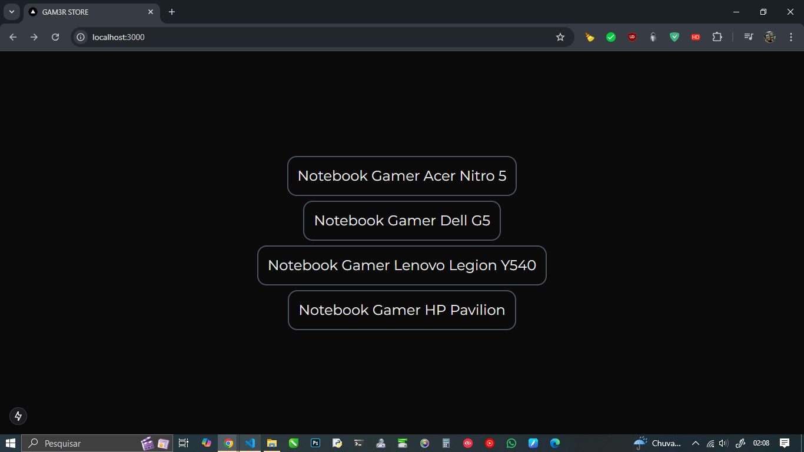</div>

[^ Sumário ^](./README.md)

### Definindo uma Lista de Componentes

Agora transformaremos um ***Array de Objetos*** literais que está dentro do arquivo `src\core\constants\produtos.ts` para uma ***Lista de Componentes*** na interface gráfica.  

```tsx
// src\app\page.tsx

import { produtos } from "@/core";
import ProdutoItem from "./components/produto/ProdutoItem";

export default function Home() {
  return (
    <div className="grid grid-cols-4 items-center justify-center space-y-2 space-x-2 m-10 h-screen">
      {produtos.map((produto) => (
        <ProdutoItem key={ produto.id } produto={ produto } />
      ))}
    </div>
  );
}
```

> ***NOTA:***
> ___
> *Toda vez que geramos uma **Lista de Componentes** através de um **Laço FOR** ou um **MAP** precisamos estabelecer uma **chave única** `key={ }` para que o React consiga alterar esse elemento específico.*
<p>

A função Home é um componente funcional escrito em React, usando TSX para renderizar a interface do usuário.  
Vamos quebrar o que ela faz, linha por linha:

1. Importações:

    ```tsx
    // src\app\page.tsx

    import { produtos } from "@/core";
    import ProdutoItem from "./components/produto/ProdutoItem";

    ...
    ```

    - A função começa importando o array `produtos` do módulo `@/core`. Esse array contém uma lista de produtos *(presumivelmente, com atributos como `id`, `nome`, `preço`, etc.)*.  

    - Também importa o componente `ProdutoItem` de um caminho relativo (`"./components/produto/ProdutoItem"`). Esse componente será usado para exibir informações sobre cada produto individualmente.

2. Definição da função `Home`:

    ```tsx
    // src\app\page.tsx

    ...
    export default function Home() {
      return (
        <div className="grid grid-cols-4 items-center justify-center space-y-2 space-x-2 m-10 h-screen">
          {produtos.map((produto) => (
            <ProdutoItem key={ produto.id } produto={ produto } />
          ))}
        </div>
      );
    }
    ```

    - A função `Home` é exportada como o componente padrão *(página principal do app React)*.  

    - Dentro do `return`, o TSX define um `div` com uma série de classes do ***Tailwind CSS*** para o layout.  
    Estas classes são:  

      - `grid`: Define um layout de grade (grid layout).  

      - `grid-cols-4`: Organiza os itens em 4 colunas.  

      - `items-center`: Alinha os itens verticalmente no centro.  

      - `justify-center`: Alinha os itens horizontalmente no centro.  

      - `space-y-2`: Define um espaçamento de 2 unidades entre os itens na direção vertical.  

      - `space-x-2`: Define um espaçamento de 2 unidades entre os itens na direção horizontal.  

      - `m-10`: Adiciona uma margem de 10 unidades ao redor da grade.  

      - `h-screen`: Faz o div ter a altura total da tela (100% da altura da janela do navegador).  

3. Renderização de `ProdutoItem`:  

    ```tsx
    // src\app\page.tsx

    ...
      {produtos.map((produto) => (
        <ProdutoItem key={ produto.id } produto={ produto } />
      ))}
    ```

    - O código usa o método `.map()` para iterar sobre o array `produtos`.  

    - Para cada item em `produtos`, é criado um componente `ProdutoItem`, passando o `produto` como uma ***prop*** para o componente, e utilizando o `id` do produto como ***key*** para ajudar o React a gerenciar o DOM de forma eficiente.  

Em resumo, a ***Função Home*** `function Home()` é um componente que exibe uma ***Lista de Produtos*** em um layout de grade, onde cada produto é renderizado através do componente `ProdutoItem`. O componente usa o ***Tailwind CSS*** para estilizar a interface, garantindo que a ***lista de produtos*** seja organizada em um ***Grid Responsivo*** e com espaçamento adequado.  

Cada produto é representado por um item individual *(`ProdutoItem`)* que recebe o objeto `produto` como uma propriedade. A `key` é usada para ajudar o React a otimizar a renderização de listas.

<div align='center'>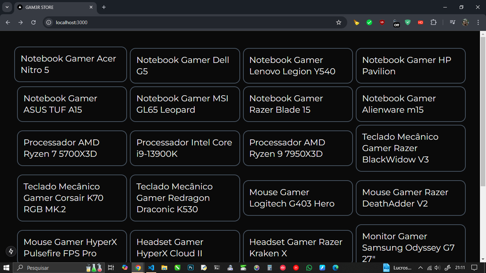</div>
<p>

[^ Sumário ^](./README.md)

## Definindo um Layout Boxed

Um ***layout boxed*** *(ou **layout em caixa**)* é um tipo de design de página em que o conteúdo da página é restrito a uma área centralizada e delimitada por uma borda, geralmente com um espaço vazio ao redor *(margens)*. Em vez de ocupar toda a largura da tela *(como ocorre no **layout full-width**, que preenche toda a largura da janela do navegador)*, o layout boxed mantém o conteúdo de uma página com uma largura fixa e um ***"gutter"*** ou espaçamento nas laterais, criando um efeito de ***"caixa"*** ao redor do conteúdo.  

### Características principais do layout boxed

- ***Conteúdo centralizado:***  
O conteúdo da página, como textos, imagens, e outros elementos, é alinhado ao centro da tela, com margens nas laterais que o distanciam das bordas da janela.

- ***Largura fixa:***  
A largura do conteúdo geralmente é definida em pixels ou outras unidades fixas *(por exemplo, **1200px** de largura)*, o que significa que, independentemente do tamanho da tela do usuário, o conteúdo não se estende além dessa largura. Isso pode ser útil para criar um layout mais controlado e previsível.

- ***Espaçamento ao redor:***  
O espaço vazio ***ao redor do conteúdo*** *(conhecido como padding ou margem externa)* ajuda a criar uma sensação de ***"respiro"*** e de que o conteúdo está em uma área separada, como se estivesse dentro de uma caixa.

- ***Estética mais organizada:***  
O ***layout boxed*** é frequentemente preferido em sites que buscam um design mais limpo e estruturado, pois o limite de largura impede que o conteúdo se espalhe demais na tela, oferecendo uma leitura mais confortável.  

### Exemplos de quando o layout boxed é utilizado

- ***Sites de portfólio:***  
Muitos designers e fotógrafos usam layouts em caixa para garantir que as imagens e o conteúdo sejam exibidos de forma clara e consistente, independentemente do tamanho da tela.  

- ***Blog ou sites institucionais:***  
Em blogs ou sites de conteúdo, um layout boxed pode tornar a leitura mais fácil e agradável, com um limite de largura que não distorce a experiência em telas grandes.  

- ***E-commerce:***  
Lojas online também podem usar layout boxed para garantir que as imagens de produtos, descrições e botões de ação não fiquem excessivamente grandes ou difíceis de interagir em telas grandes.

### Comparação com o Layout Full-Width

- ***Full-width:***  
No ***layout full-width***, o conteúdo da página se estende por toda a largura da janela do navegador, independentemente do tamanho da tela. Isso pode ser ideal para criar uma experiência visual mais expansiva, mas pode ser menos controlado.  

- ***Boxed:***  
No ***layout boxed***, o conteúdo está restrito a uma largura definida, o que proporciona uma experiência mais controlada e centrada.  

### Como aplicar um layout boxed no CSS?

No caminho `src\app` edite o arquivo `globals.css` para que possamos configurar o CSS no Tailwind CSS.  

O Tailwind, é organizado em 3 partes ***base, componentes e utilitários*** *(`base`, `components` e `utilities`)* e podemos extender essas camadas ***"layers"*** através da marcação `@layer` alguma coisa como por exemplo:  

```css
/* src\app\globals.css */

...
@layer components {
  .container {
    @apply max-w-7xl mx-auto px-10;
  }
}
...
```

### Explicação de cada parte

1. `@layer components`:  

    O ***Tailwind CSS*** permite organizar e agrupar estilos em camadas *(layers)*. A diretiva `@layer` é usada para inserir regras de estilo dentro de uma camada específica. O Tailwind possui três camadas principais:  

    - `base`: Para estilos base *(como `body`, `html`, etc.)*.  
  
    - `components`: Para componentes reutilizáveis *(como `botões`, `cards`, `containers`, etc.)*.  
  
    - `utilities`: Para classes utilitárias, que são a base do funcionamento do Tailwind.  
  
    Nesse caso, você está criando ou adicionando um componente à camada `components`.  

2. `.container`:  

    Aqui você está criando uma classe CSS chamada `.container`. Esse nome é frequentemente usado para definir um container de largura máxima, centralizado na página, que limita a largura do conteúdo dentro dele. É um padrão comum em muitos sites para melhorar a legibilidade e garantir que o conteúdo não se estenda demais na tela.  

3. `@apply`:  

    A diretiva `@apply` é uma funcionalidade do Tailwind CSS que permite aplicar classes utilitárias diretamente dentro de um arquivo CSS. Ela é útil quando você deseja criar um conjunto de classes reutilizáveis de forma mais compacta e legível.  

    Nesse caso, as classes utilitárias estão sendo aplicadas à classe `.container`:  

      - `max-w-7xl`:  
      Define a largura máxima do container. O valor `7xl` corresponde a uma largura específica de ***80rem (1280px)***. Ou seja, o container pode ter até 80rem de largura, mas nunca mais que isso.  
  
      - `mx-auto`:  
      Centraliza o container horizontalmente, definindo as margens esquerda e direita *(**margin-left** e **margin-right**)* como automáticas. Isso garante que o container fique centralizado na tela.  
  
      - `px-10`:  
      Define um ***padding de 10 unidades*** nas direções ***esquerda*** e ***direita*** *(em Tailwind, o *padding* é um valor proporcional ao sistema de espaçamento configurado no Tailwind, normalmente `0.25rem`, `0.5rem`, etc.)*.  
      Então, ***px-10*** aplica um ***padding-left*** e ***padding-right*** de ***2.5rem (40px)***.  

Agora que temos nossa área ***Boxed*** definida, podemos utilizar em nossa página para que ela tenha uma área Boxed delimitada para que possamos criar nossa aplicação, então, edite o arquivo `page.tsx` no caminho `src\app`.  

```tsx
// page.tsx

    ...
    <div className="flex-1 flex flex-col container gap-5 py-10">
      ...
    </div>
    ...

```

Agora, vamos envolver o Componente `ProdutoItem` com uma `div` contendo a Classe Tailwind CSS `container` que acabamos de criar, juntamente com as Classes `flex flex-1 flex-col` para que os Componentes sejam distribuídos em colunas `gap-5` para ter um espaço de 20px entre os Componentes e `py-10` para ter um padding no topo e na base de 40px, até aqui o código está desta forma:

```tsx
// src/app/page.tsx

import { produtos } from "@/core";
import ProdutoItem from "./components/produto/ProdutoItem";

export default function Home() {
  return (
    <div className="flex flex-1 flex-col container gap-5 py-10">
      <div className="grid grid-cols-4 gap-5">
        {produtos.map((produto) => (
          <ProdutoItem key={produto.id} produto={produto} />
        ))}
      </div>
    </div>
  )
}

```

### Explicação das Classes className

- `flex`:  
Define o ***contêiner*** como um elemento flexível, utilizando o modelo de ***layout Flexbox***.  

- `flex-1`:  
Faz com que o elemento ocupe o máximo de espaço disponível, dividindo-o igualmente com outros elementos que também tenham ***flex-1***.  

- `flex-col`:  
Define a direção do layout como ***coluna***, organizando os ***elementos filhos*** verticalmente.  

- `container`:  
Utiliza a ***largura máxima*** definida pela classe container, ***centralizando*** o conteúdo horizontalmente na página.  

- `gap-5`:  
Define um espaço ***(gap)*** de 5 unidades entre os elementos filhos do contêiner.  

- `py-10`:  
Adiciona um ***padding de 10 unidades*** verticalmente *(**py**, para `padding-top` e `padding-bottom`)*, criando um espaçamento interno na parte superior e inferior do contêiner.

Essas classes `className` ajudam a organizar a lista de produtos em uma coluna, com espaçamento interno e entre os itens. Utilizar `flex-col` dentro de um contêiner `flex` permite que os itens sejam organizados ***verticalmente***. O espaçamento ***interno*** e ***externo*** cria um layout mais espaçado e organizado.

Na imagem abaixo podemos observar como está ficando:  

<div align='center'>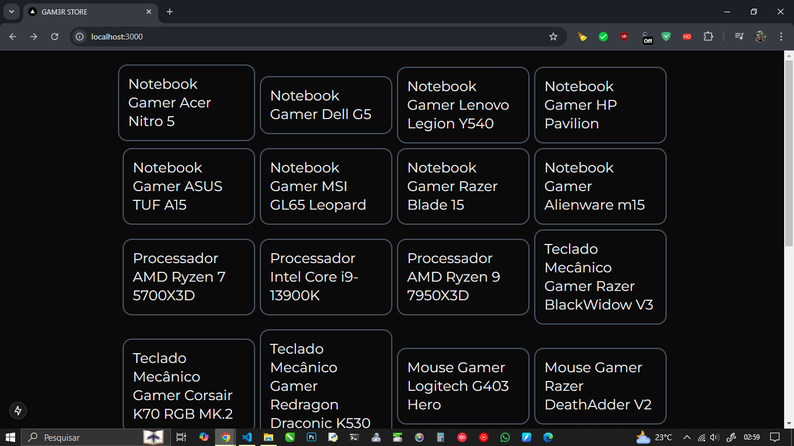</div>

[^ Sumário ^](./README.md)

## Definindo Rotas Dinâmicas

Para que nosso `ProdutoItem` funcione nas ***Rotas Dinâmicas*** precisamos converte-lo em um `LINK` e para isso precisamos fazer algumas alterações no arquivo `ProdutoItem.tsx` que se encontra no caminho `src\app\components\produto`.  

```tsx
// ProdutoItem.tsx

import { Produto } from '@/core'
import Link from 'next/link'

export interface ProdutoItemProps {
  produto: Produto
}

export default function ProdutoItem(props: ProdutoItemProps) {
  const { produto } = props
  return (
    <Link
      href={`/produto/${props.produto.id}`}
      className="flex flex-col border-2 bg-violet-dark border-cyan-400/30 rounded-2xl relative max-w-[350px]"
    >
      {produto.nome}
    </Link>
  )
}
```

Agora vamos ver o que cada parte alteramos faz:  

### 1. Importações

```tsx
// ProdutoItem.tsx

import { Produto } from '@/core'
import Link from 'next/link'

...
```

- `Produto`:  
Está sendo importado de `'@/core'`. Presumivelmente, `Produto` é um tipo ou interface que define as propriedades de um produto, como `id`, `nome`, etc.  

- `Link`:  
Vem da biblioteca `next/link`, que é uma maneira de criar links de navegação entre páginas no Next.js. `Link` permite uma navegação otimizada para Single Page Applications *(SPAs)*.

### 2. Interface `ProdutoItemProps`

```tsx
// ProdutoItem.tsx

...
export interface ProdutoItemProps {
  produto: Produto
}

...
```

Aqui, é declarada uma interface chamada `ProdutoItemProps`. Ela define que o componente `ProdutoItem` espera uma propriedade chamada `produto`, que é do tipo `Produto`. O tipo Produto contém informações como `id`, `nome` e outras propriedades relacionadas a um produto.  

### 3. Componente `ProdutoItem`

```tsx
// ProdutoItem.tsx

...
export default function ProdutoItem(props: ProdutoItemProps) {
  const { produto } = props
  return (
    <Link
      href={`/produto/${props.produto.id}`}
      className="flex flex-col border-2 bg-violet-dark border-cyan-400/30 rounded-2xl relative max-w-[350px]"
    >
      {produto.nome}
    </Link>
  )
}
```

- `Declaração do Componente`:  
`ProdutoItem` é uma função que recebe props do tipo `ProdutoItemProps`. Dentro do componente, ele extrai a propriedade `produto` de `props`.  

- `Elemento Link`:  
  - O componente retorna um elemento `Link`, que é usado para criar um link de navegação para uma página de detalhes do produto.  

  - O atributo `href` é configurado dinamicamente para apontar para a URL `/produto/${props.produto.id}`, onde `produto.id` é o identificador único do produto. Isso cria um link para a página de detalhes desse produto específico.  

  - ***Estilos:***  
  O `Link` possui uma série de classes utilitárias do ***Tailwind CSS*** que estilizam o componente:
  
    - `text-2xl`:  
    Define o tamanho da fonte como `2xl` *(muito grande)*.  
  
    - `border-2 border-gray-600`:  
    Aplica uma borda de `2px` de espessura, com a cor cinza-escuro *(`#4b5563`)*.  
  
    - `rounded-2xl`:  
    Aplica bordas arredondadas de `2xl`.  

    - `p-4`:  
    Aplica um `padding` *(espaçamento interno)* de `1rem` em todos os lados.  
  
  - ***Conteúdo do Link***:  
    Dentro do `Link`, é exibido o nome do produto, acessado via `produto.nome`.

Em resumo, é um componente simples usado para exibir uma lista de produtos, onde cada item é um link para a página de detalhes desse produto específico.  
Neste ponto, ele está navegando para uma página que ainda não existe, mas, já iremos solucionar esse problema criando a Rota.  

[^ Sumário ^](./README.md)

## Criando uma Rota Dinâmica

No caminho `src\app` qualquer diretório que for criado dentro, podemos criar uma Rota a partir dela, então, crie um diretório `\produto` e dentro iremos criar uma ***Rota Dinâmica*** utilizando o padrão que nomeia o diretório entre colchetes `\[id]` com isso, criamos uma Rota Dinâmica para o `ID` do `ProdutoItem`, agora, dentro da rota que acabamos de criar, crie o arquivo `page.tsx`.  

> ***NOTA:***
> ___
> Não se esqueça que pode usar o atalho de criar o diretório e o arquivo de uma só vez.  
> Clique em criar ***Novo Arquivo*** e digite: `produto\[id]\page.tsx` e pronto, tudo criado.  
<p>

```tsx
// page.tsx

import { produtos } from "@/core"

export default function PaginaProduto(props: any) {
  const id = +props.params.id
  const produto = produtos.find((produto) => produto.id === id)
  return (
    <div className="flex items-center justify-center h-screen">
      <div className="text-2xl border-2 border-gray-600 rounded-2xl p-4">
        <h1>Produto: {produto?.nome}</h1>
      </div>
    </div>
  )
}
```

> [!WARNING]
> Quando utilizamos `(props: any)` como parâmetro, o ***ESLint*** exibe um alerta de que não pode ser usado, então vamos desativar essa regra no arquivo que se encontra na raiz da aplicação Frontend `.eslintrc.json` e adicionaremos a seguinte regra: `"rules": { "@typescript-eslint/no-explicit-any": "off" }`.

<br>

```JSON
// .eslintrc.json

{
  "extends": ["next/core-web-vitals", "next/typescript"],
  "rules": {
    "@typescript-eslint/no-explicit-any": "off"
  }
}
```

Como observamos acima, ***Função*** `PaginaProduto` é um ***Componente React*** que renderiza uma página para exibir informações sobre um ***produto específico*** com base no `ID` passado como parâmetro na URL.  
Vamos descrever seu funcionamento detalhadamente:

## Descrição do Componente

### 1. Importação de Dados

- `import { produtos } from "@/core"`:  
A função importa um ***array*** `produtos` do arquivo `constants\produtos.ts` dentro do diretório `\core`. Esse array contém ***objetos de produto***, e cada produto possui um ***ID único*** e outras propriedades *(como `nome`, `preço`, etc.)*.  

### 2. Função do Componente

- O componente é definido como uma função que recebe `props` (provavelmente passadas pelo Next.js ou pelo React Router) e retorna JSX para renderizar o conteúdo.  

### 3. Recuperação do ID do Produto

- `const id = +props.params.id`:  
A função acessa o `id` do produto a partir das `params` que estão nas propriedades `props`. A conversão `+` é usada para garantir que o ID seja tratado como um número *(caso venha como string)*.  

### 4. Busca do Produto

- `const produto = produtos.find((produto) => produto.id === id)`:  
Em seguida, o componente usa o método `find` para buscar o produto correspondente ao `id` informado. O `find` retorna o primeiro produto que tem o mesmo `ID`. Caso não encontre, produto será `undefined`.  

### 5. Renderização do JSX

- A função retorna um ***JSX*** com a estrutura de uma página. Ela renderiza uma `div` centralizada na tela com:  
  - ***Título:***  
  Um título `Produto: {produto?.nome}`. O `?`. é utilizado para garantir que, caso `produto` seja `undefined` *(quando não encontrado)*, não haja erro ao tentar acessar a propriedade nome.  

  - ***Estilo:***  
  A `div` tem classes de estilo do ***Tailwind CSS***, como `flex`, `items-center`, `justify-center`, `h-screen`, entre outras, que garantem que o conteúdo será centralizado na tela e com um design simples *(borda, espaçamento, etc.)*.  

Resumindo, este componente recebe um ***id de produto*** via parâmetros da URL, encontra o ***produto correspondente*** a esse id no ***array produtos*** e renderiza o nome do produto em uma página centralizada. Se o produto não for encontrado, o comportamento atual não mostra nenhuma mensagem de erro, o que será melhorado mais adiante.

Agora como podemos observar na imagem abaixo, quando clicamos em um produto da Lista de Produtos, somos enviados para a página referente ao produto clicado, e tudo isso graças a Rota Dinâmica que acabamos de criar.

<div align='center'>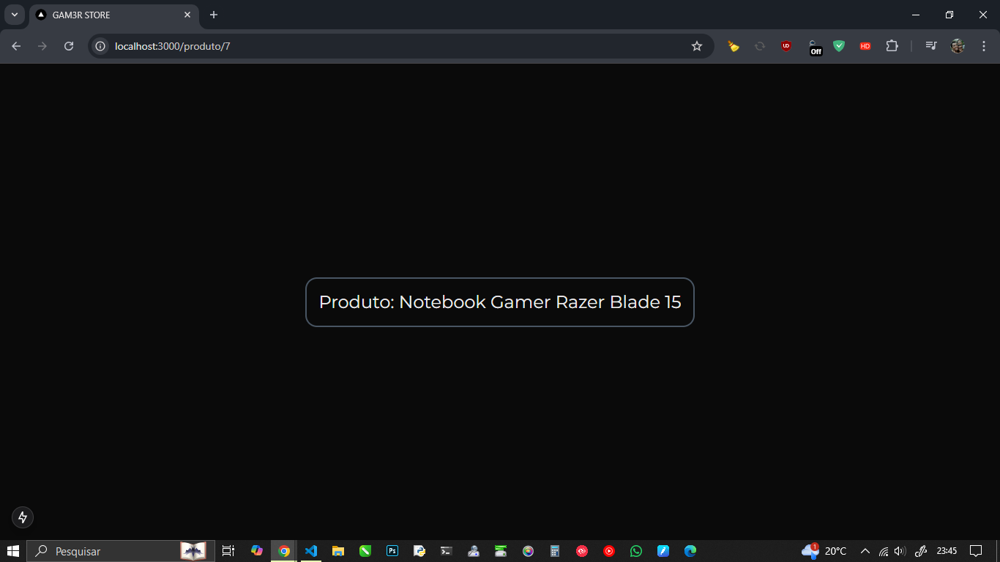</div>

[^ Sumário ^](./README.md)

## Adicionando uma Cor ao Tema do Tailwind CSS

Agora veremos como adicionar uma cor personalizada ao Tema do ***Tailwind CSS*** para poder utilizar na aplicação.  
Para isso, precisamos editar o arquivo `tailwind.config.ts` que se encontra na raiz da aplicação Frontend.

```ts
// tailwind.config.ts

...
  theme: {
    extend: {
      colors: {
        background: "var(--background)",
        foreground: "var(--foreground)",
        'violet-dark': {
          // DEFAULT: "#0E001D",
          DEFAULT: '#10041f',
          foreground: '#FFF',
        },
      },
    },
  },
...
```

Como podemos observar dentro de `theme:` o estendemos `extend:` e editamos as cores `colors` adicionando nossa cor personalizada `violet-dark`, deixando como cor padrão do background a cor `DEFAULT: "#0E001D"` e para o texto a cor `foreground: "#FFF"` e com essa configuração, quando estivermos programando o VSCode completará o nome da cor.  

Agora vamos editar o arquivo `ProdutoItem.tsx` adicionando a cor de background `bg-violet-dark` que acabamos de criar ao `ClassName` do componente.  

<div align='center'>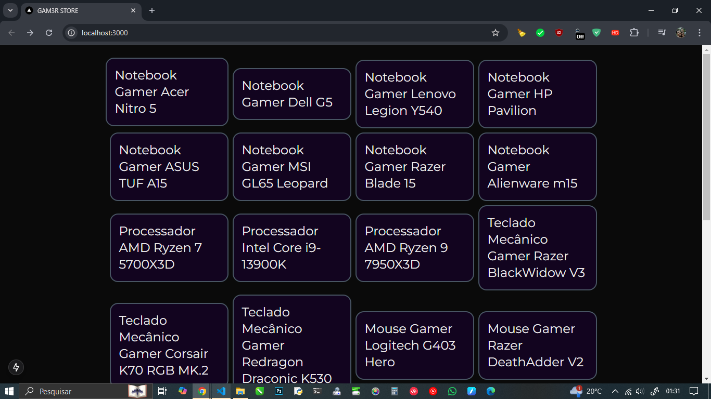</div>

Como pode ser observado, o tom da cor é bem escuro quase igual ao tema dark do Chrome, mas dá pra perceber uma pequena diferença no tom, posteriormente essa cor será modificada.

[^ Sumário ^](./README.md)

## Exibindo Imagem na Aplicação

Para que possamos exibir as imagens dos produtos que estão cadastras no arquivo `src\core\constants\produtos.ts`, precisamos realizar algumas configurações no projeto.  
primeiro vamos adicionar uma imagem sem realizar a configuração para que possamos observar o erro.  

```tsx
// ProdutoItem.tsx

import { Produto } from '@/core'
import Image from 'next/image'
import Link from 'next/link'

export interface ProdutoItemProps {
  produto: Produto
}

export default function ProdutoItem(props: ProdutoItemProps) {
  const { produto } = props
  return (
    <Link
      href={`/produto/${props.produto.id}`}
      className="text-2xl border-2 bg-violet-dark border-gray-600 rounded-2xl p-4"
    >
      <div className="w-full h-48 relative">
        <Image
          src={produto.imagem}
          fill
          className='object-contain'
          alt='Imagem Produto'
        />        
      </div>
      {produto.nome}
    </Link>
  )
}
```

### Descrição do Código

O código acima renderiza uma imagem dentro de um `div` com largura completa (`w-full`) e altura fixa de 48 unidades (`h-48`). Utiliza-se o componente `Image` para exibir a imagem do produto, ocupando todo o espaço disponível do `div` devido ao uso da propriedade `fill`. A classe `object-contain` é aplicada para garantir que a imagem mantenha suas proporções, ajustando-se dentro do contêiner.

```tsx
<div className="w-full h-48 relative">
  <Image
    src={produto.imagem}
    fill
    className='object-contain'
    alt='Imagem Produto'
  />        
</div>
```

### Explicação dos Atributos

- `w-full`:  
Define que a largura do contêiner será de 100% do elemento pai.  

- `h-48`:  
Define a altura do contêiner como 48 unidades (tailwindcss).  

- `relative`:  
A classe relative permite o posicionamento absoluto do conteúdo interno em relação a este contêiner.  

- `fill`:  
Permite que a imagem preencha todo o contêiner div.  

- `object-contain`:  
Garante que a imagem seja redimensionada proporcionalmente dentro do contêiner.  

- `alt`:  
Texto alternativo para a imagem, importante para acessibilidade.  

Quando adicionamos uma imagem na Aplicação sem a devida configuração, a mensagem de erro abaixo será exibida:  

<div align='center'>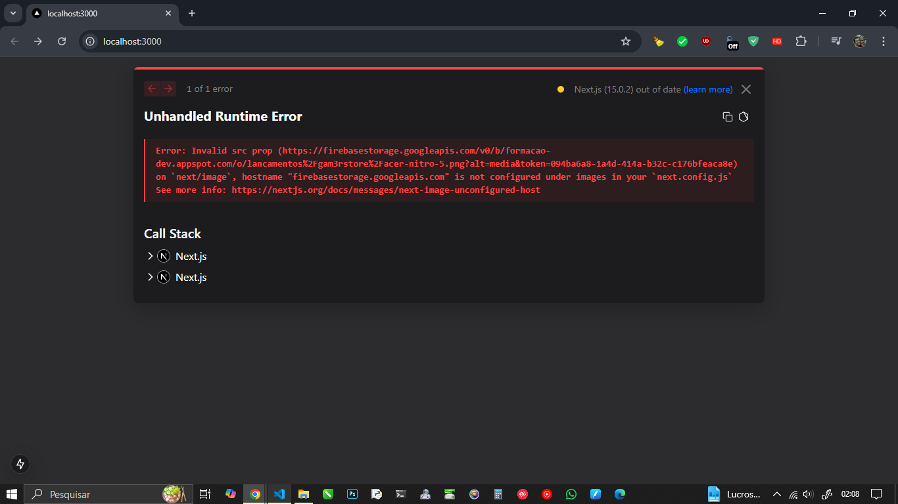</div>
<br>

[^ Sumário ^](./README.md)

### Corrigindo o Erro de Exibição de Imagem

Para que as imagens do Projeto possam ser exibidas, precisamos liberar o caminho da imagem que está no Firebase `firebasestorage.googleapis.com` na Aplicação Nextjs.  

Então, precisamos editar o arquivo `next.config.ts` que se encontra na rais da aplicação Frontend.  
Precisamos adicionar os atributos: `images:`, `remotePatterns:`,  `protocol:` *(somente o protocolo Ex.: `https` sem `://` )* e `hostname:`*(contendo o caminho `firebasestorage.googleapis.com`)*.  

```ts
// next.config.ts

import type { NextConfig } from "next";

const nextConfig: NextConfig = {
  images: {
    remotePatterns: [
      {
        protocol: 'https',
        // hostname: '**', //* Libera qualquer URL
        hostname: 'firebasestorage.googleapis.com',
      },
    ],
  },
}

export default nextConfig;
```

Com essa alteração realizada as imagens já podem ser exibidas na aplicação, como podemos observar na imagem abaixo:  

<div align='center'>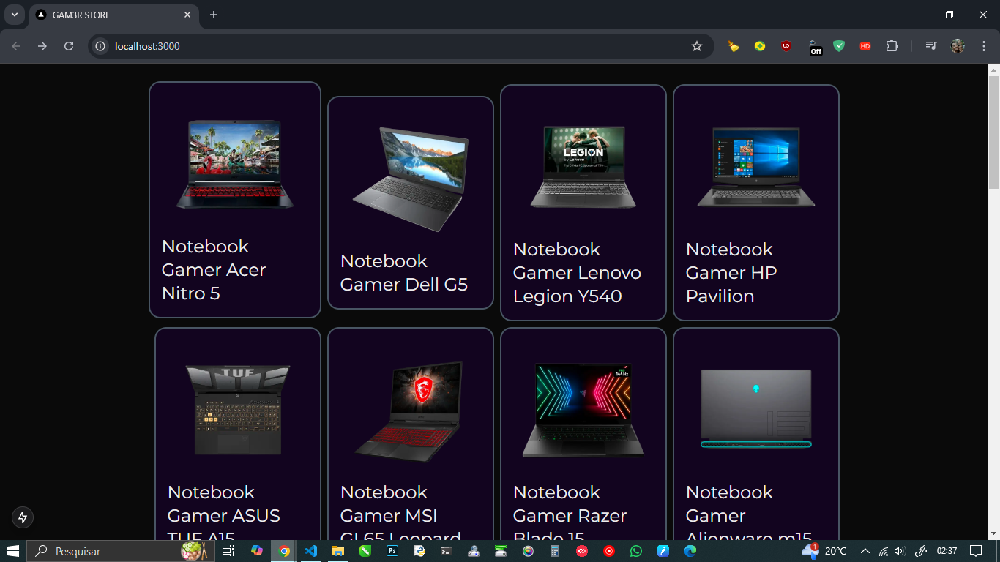</div>

[^ Sumário ^](./README.md)

## Exibindo Informações do Produto

As informações do produto, serão exibidas em diversas `div` uma embaixo da outra, a seguir, veremos como ficará o código.

## Nome do Produto

Para o ***Nome do Produto***, iremos dividir a `div` com uma borda no topo com 2px de espessura `border-t-2` para separar visualmente a imagem das informações do produto e em seguida exibimos o nome do produto `{produto.nome}` em um `span`, como podemos ver a seguir.  

```tsx
// ProdutoItem.tsx

      ...
      <div className="flex flex-1 flex-col gap-3 p-5 border-t-2 border-cyan-400/30">
        <span className="text-lg font-semibold">{produto.nome}</span>
      </div>
      ...
```

[^ Sumário ^](./README.md)

## Especificação em Destaque

O ***destaque*** será exibido no inicio da linha `self-start`, com uma fonte pequena `text-sm`, comm uma linha tracejada na parte de baixo `border-b border-dashed`, como podemos ver a seguir.

```tsx
// ProdutoItem.tsx

        ...
        <span className="self-start text-sm border-b border-dashed">
          {produto.especificacoes.destaque}
        </span>
        ...
```

Logo abaixo vamos adicionar uma `div` contendo somente a classe `flex-1` para que se ajuste crescendo ou diminuindo quando necessário para que crie um espaço entre o Destaque e o valor, para que os botões fiquem sempre alinhados na base.

```tsx
// ProdutoItem.tsx

        ...
        <div className="flex-1"></div>
        ...
```

[^ Sumário ^](./README.md)

## Preço do Produto

Para poder exibir o ***Preço Base*** e o ***Preço Promocional*** precisamos criar uma `div` com as Classes `flex flex-col` para que fique um ao lado do outro.  

### 1. Preço Base

O ***Preço Base*** será exibido dentro de um `span` com fonte pequena `text-sm` com uma cor cinza de menos destaque `text-gray-400` e com um risco no meio do texto `line-through`, por fim, será formatado com a ***Classe Utilitária*** `Moeda` criada no ***Core da Aplicação*** `{Moeda.formatar(produto.precoBase)}` e não esquecendo de importar a Classe Moeda `import { Moeda, Produto } from '@/core'`.

```tsx
// ProdutoItem.tsx

import { Moeda, Produto } from '@/core'

        ...
        <div className="flex flex-col">
          <span className="text-sm text-gray-400 line-through">
            de {Moeda.formatar(produto.precoBase)}
          </span>
          ...
        </div>
        ...
```

### 2. Preço Promocional

O ***Preço Promocional,*** será exibido dentro de um `span` com uma fonte maior `text-xl` de peso 600 `font-semibold` com a cor verde claro `text-emerald-400`, logo abaixo do `Preço Base`, como podemos observar no trecho de código abaixo.

```tsx
// ProdutoItem.tsx

        ...
        <div className="flex flex-col">
          ...
          <div className="text-xl semibold text-emerald-400">
            por {Moeda.formatar(produto.precoPromocional)}
          </div>
          ...
        </div>
        ...
```

### 3. Botão Adicionar

O ***Botão Adicionar*** será exibido na cor violeta escuro `bg-violet-700` com altura de 32px `h-8` o efeito de passar o mouse por cima exibirá o contorno com 2px de espessura na cor verde claro `hover: border-2 border-emerald-500` com os cantos arredondados 100% `rounded-full` com um ícone e o texto "Adicionar" centralizados `flex justify-center items-center` e espaçados `gap-2`, sem esquecer de importar o ícone do carrinho de compras`import { IconShoppingCartPlus } from '@tabler/icons-react'`, como podemos ver abaixo.  

> ***NOTA:***
> ___
> Como o botão precisa do evento `onClick` para funcionar, precisamos adicionar antes dos imports `'use client'` para que não seja exibido um erro na tela, pois o evento de click funciona do lado do cliente (no navegador).  
<p>

```tsx
// ProdutoItem.tsx

        ...
        <div className="flex flex-col">
          ...
          <button
            className="flex justify-center items-center gap-2 h-8 bg-violet-700 hover:border-2 border-emerald-500 rounded-full"
            onClick={((e) => {
              e.preventDefault()
              console.log('Produto Adicionado')
              // adicionarItem(produto)
            })}
          >
            <IconShoppingCartPlus size={20} />
            <span>Adicionar</span>
          </button>
          ...
        </div>
        ...
```

Como podemos observar na imagem abaixo, temos uma área marcada em laranja, esse é o espaço que será ajustado quando houver necessidade.  

<div align='center'>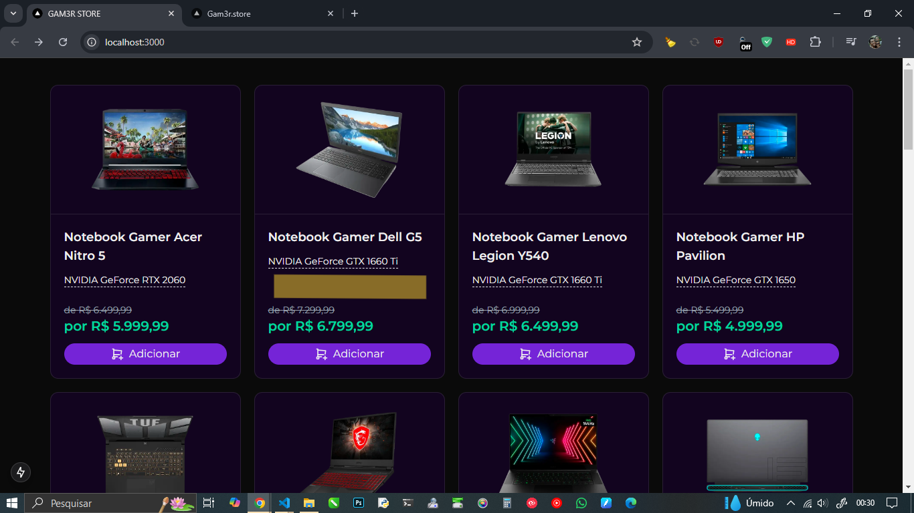</div>

[^ Sumário ^](./README.md)

## Exibindo Notas de Review

Neste momento, iremos criar um componente que irá exibir as ***Notas de Review*** do produto. Essas notas, serão representadas por ***5 estrelas*** que serão exibidas no lado superior direito da imagem de cada produto.
Nossa página inicial deverá estar parecida com a imagem abaixo quando terminar-mos, note as estrelas, esse será nosso passo atual.  

<div align='center'>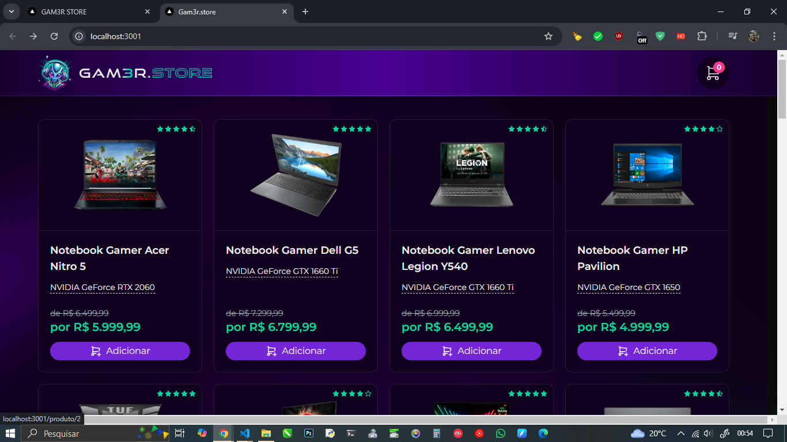</div>

<br>

Agora, no caminho `src\app\components` crie um novo diretório `\shared` *(compartilhado)* e crie um arquivo `NotasReview.tsx`.  

> **ATALHO:**
> ___
> *Crie um novo arquivo `shared\NotasReview.tsx` que irá criar o diretório e o arquivo ao mesmo tempo.*

<br>

O ***componente NotaReview*** exibe uma avaliação por estrelas com base em uma nota passada como propriedade. Ele usa ***ícones de estrelas*** importados para representar a avaliação visualmente, permitindo ***estrelas inteiras***, ***metade de estrelas*** ou ***estrelas vazias***, conforme o valor da nota.  
Agora vamos analisar o código:

```tsx
// NotasReview.tsx

import { IconStar, IconStarFilled, IconStarHalfFilled } from "@tabler/icons-react"

export interface NotaReviewProps {
  nota: number
  tamanho?: number
  produtoId: number
}

export default function NotaReview(props: NotaReviewProps) {
  function notaParaEstrelas(nota: number) {
    const estrelas = []
    for (let i = 1; i <= 5; i++) {
      //* Gera uma chave única combinando ID do produto e o índice.
      const key = `${props.produtoId}-${i}`
      if (nota >= i) {
        estrelas.push(<IconStarFilled key={key} size={props.tamanho ?? 12} />)
      } else if (nota >= i - 0.5) {
        estrelas.push(<IconStarHalfFilled key={key} size={props.tamanho ?? 12} />)
      } else {
        estrelas.push(<IconStar key={key} size={props.tamanho ?? 12} />)
      }
    }
    return estrelas
  }
  return <div className="flex gap-0.5 text-emerald-400">{notaParaEstrelas(props.nota)}</div>
}
```

## Explicação dos Atributos e Funções

- ***Propriedades*** (`NotaReviewProps`):

  - ***nota***:  
  Define a ***Nota da Avaliação***, variando de `0` a `5`.  

  - ***tamanho?***:  
  ***Opcional***, define o ***tamanho dos ícones*** das estrelas. Se não for fornecido, o tamanho padrão é `12`.  

  - ***produtoId***:  
  Define o ***ID do produto***, necessário para gerar as chaves `key`únicas.

- ***Função `notaParaEstrelas`***:  
Recebe a ***nota*** e converte em um ***array de ícones*** de estrelas, baseado nas seguintes condições:  

- ***Estrela cheia (`IconStarFilled`)***:  
Adicionada ao ***array*** `se` a ***nota*** `for igual ou maior` que o valor inteiro correspondente à posição da estrela.  

- ***Meia estrela (`IconStarHalfFilled`)***:  
Adicionada se a ***nota*** estiver entre um `valor inteiro` e o `meio do próximo`.  

- ***Estrela vazia (`IconStar`)***:  
Adicionada se a ***nota*** for menor que o valor da posição atual da estrela.  

Esta função gera um array de 5 elementos, representando a avaliação visual.  

### Classe className do Contêiner Principal

O contêiner que exibe as estrelas possui as seguintes classes:

- `flex`:  
Organiza as estrelas em linha usando o ***layout Flexbox***.  

- `gap-0.5`:  
Define um espaçamento de 0.5 unidade entre cada estrela, para melhorar a aparência visual.  

- `text-emerald-400`:  
Define a cor das estrelas em um tom de verde esmeralda.

O componente `NotaReview` é útil para exibir avaliações em uma interface de usuário, variando entre estrelas cheias, meias estrelas e estrelas vazias. Ele pode ser utilizado em páginas de produtos ou avaliações para representar visualmente uma média de nota.

[^ Sumário ^](./README.md)

### Adicionando NotaReview ao ProdutoItem

Para que possamos posicionar um item de forma `absoluta` é preciso que o ***Elemento Pai*** seja definido de forma `relativa` que em nosso caso é o Componente `LINK`.

```tsx
// src\app\components\produto\ProdutoItem.tsx

    ...
    <Link
      href={`/produto/${props.produto.id}`}
      className="
      flex flex-col border-2 bg-violet-dark border-cyan-400/30 
      rounded-2xl relative max-w-[350px]
      "
    >
      ...
```

Para exibir o Componente que acabamos de definir precisamos adiciona-lo acima da imagem do produto.  

```tsx
// src\app\components\produto\ProdutoItem.tsx

      ...
      <div className="flex absolute justify-end top-2.5 right-2.5">
        <NotaReview produtoId={produto.id} nota={produto.nota} />
      </div>
      ...
```

Com isso, adicionamos as estrelas de forma absoluta no lado superior direito com 10px de margem tanto no topo quando no lado direito.  
Abaixo podemos verificar como a página está ficando:  

<div align='center'>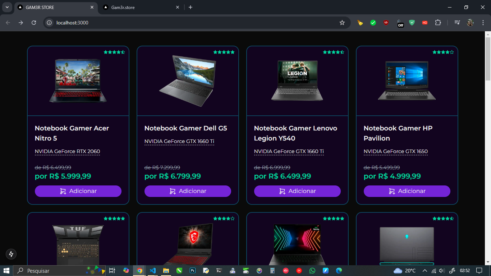</div>
<br>

[^ Sumário ^](./README.md)

## Criando o Layout da Aplicação

Agora iremos definir o ***Layout da Aplicação*** onde teremos o Cabeçalho, Body, Rodapé e o que mais for necessário adicionar na aplicação.  

Mas antes de tudo, precisamos importar as imagens para o nosso projeto *(background.png, logo.png e logo-texto.png)* esses arquivos serão salvos no caminho `public\` que se encontra na raiz da Aplicação Frontend.  

[^ Sumário ^](./README.md)

### Componente Logo

O ***componente Logo*** é responsável por exibir a marca visual da Aplicação, com um ícone e um texto de logo, e também funciona como um link para a página inicial. Ele é utilizado para que os usuários possam identificar a identidade visual da Aplicação e, ao clicar, retornem à ***home page***.  

No caminho `src\app\components\` crie um novo diretório `shared\` e um arquivo `Logo.tsx` e para facilitar crie o arquivo e o diretório de uma só vez, como vimos anteriormente.

```tsx
// Logo.tsx

import Image from 'next/image'
import Link from 'next/link'

export default function Logo() {
    return (
      <Link href="/" className="flex items-center gap-3">
            <Image src="/logo.png" height={60} width={60} alt="logo" />
            <Image src="/logo-texto.png" width={230} height={0} alt="logo" />
        </Link>
    )
}
```

Abaixo, uma explicação de cada parte do código para iniciantes:

***Importações:***

```tsx
import Image from 'next/image'
import Link from 'next/link'
...
```

- `Image`:  
Utilizado para carregar e exibir imagens com otimizações automáticas, como carregamento preguiçoso (`lazy loading`).

- `Link`:  
Usado para navegação interna no Next.js sem recarregar a página.

***Estrutura do Componente:***

```tsx
...
export default function Logo() {
    return (
        <Link href="/" className="flex items-center gap-3">
            <Image src="/logo.png" height={60} width={60} alt="logo" />
            <Image src="/logo-texto.png" width={230} height={0} alt="logo" />
        </Link>
    )
}
```

***Link:***  

Envolve as imagens, tornando todo o componente clicável.  
O atributo `href="/"` define que o link levará o usuário para a página inicial.  

A classe `flex items-center gap-3`:  

- `flex`: Alinha as imagens horizontalmente.
- `items-center`: Centraliza verticalmente as imagens.  
- `gap-3`: Adiciona um espaço entre o ícone e o texto.  

***Imagens:***

Primeira imagem (`/logo.png`):  

- Representa o ícone da logo.
- Largura e altura fixas de 60px.

Segunda imagem (`/logo-texto.png`):  

- Contém o texto do logotipo.
- Largura fixa de `230px`, mas altura definida como `0` para evitar distorções *(altura será ajustada automaticamente pelo Next.js)*.

***Alt:***

Fornece texto alternativo para acessibilidade *(lê-se quando a imagem não carrega ou por leitores de tela)*.

[^ Sumário ^](./README.md)

### Componente IconeCarrinho

O componente `IconeCarrinho` é um ***Ícone de Carrinho de Compras*** que exibe a quantidade de itens dentro dele. É ideal para ser utilizado em cabeçalhos de sites ou interfaces de e-commerce, onde o usuário pode ver a quantidade de produtos adicionados ao carrinho.  

No caminho `src\app\components\` crie um novo diretório `shared\` e um arquivo `IconeCarrinho.tsx` e para facilitar crie o arquivo e o diretório de uma só vez, como vimos anteriormente.

```tsx
// IconCarrinho.tsx

import { IconShoppingCart } from '@tabler/icons-react'

export interface IconeCarrinhoProps {
    qtdeItens: number
}

export default function IconeCarrinho(props: IconeCarrinhoProps) {
    return (
        <div className="flex justify-center items-center rounded-full w-14 h-14 bg-violet-dark relative">
            <IconShoppingCart size={30} stroke={1.3} />
            <div className="absolute top-2 right-2 bg-violet-600 text-white text-xs font-semibold rounded-full w-5 h-5 flex items-center justify-center">
                {props.qtdeItens ?? 0}
            </div>
        </div>
    )
}
```

***Estrutura do Componente:***

O componente recebe as seguintes propriedades:

- ***qtdeItens (obrigatório)***:  
Indica a quantidade de itens no carrinho. Se nenhum valor for passado, o componente exibirá `0` como padrão.  

***Funcionamento:***

- O ícone principal do carrinho é representado pelo componente `IconShoppingCart`, importado da biblioteca `@tabler/icons-react`.  

- Um pequeno contador no canto superior direito do carrinho exibe a ***quantidade de itens***, estilizado para parecer uma etiqueta redonda.  

***Implementação:***

A seguir, uma explicação detalhada para cada parte do código:

***1. Contêiner Principal (`div`):***

- ***Estilizado com***:  

  - `flex`:  
  Posiciona os itens no centro com Flexbox.
  - `justify-center` e `items-center`:  
  Alinha o ícone no centro do contêiner.
  - `rounded-full`:  
  Dá um formato redondo ao contêiner.
  - `w-14 h-14`:  
  Define largura e altura fixas de 56px.
  - `bg-violet-dark`:  
  Aplica um fundo na cor roxa escura.
  - `relative`:  
  Permite que o contador seja posicionado dentro do contêiner.  

***2. Ícone do Carrinho (`IconShoppingCart`):***

- `size={30}`:  
Define o tamanho do ícone em `30px`.
- `stroke={1.3}`:  
Controla a espessura das linhas do ícone.

***3. Contador de Itens:***

- Posicionado no canto superior direito com `absolute` `top-2` `right-2`.

- ***Estilizado como:***

  - `bg-emerald-400`: Fundo verde esmeralda.
  - `text-white`: Texto branco.
  - `text-xs font-semibold`: Texto pequeno e em negrito.
  - `rounded-full`: Formato redondo.
  - `w-5 h-5`: Tamanho fixo de `20px`.
  - `flex items-center justify-center`: Centraliza o número dentro do círculo.

> [!IMPORTANT]
> ***Propriedades (`props`)***:  
> No React, as propriedades permitem passar dados de um componente pai para um componente filho.  
> Aqui, `qtdeItens` é uma propriedade usada para mostrar a quantidade de itens no carrinho.  
> ***Flexbox (`flex`)***:  
> Usado para alinhar o conteúdo dentro de contêineres de maneira fácil.  
> ***Classes CSS do Tailwind***:  
> As classes adicionam estilos pré-definidos ao componente. No caso, usamos `rounded-full` para bordas arredondadas e `relative` para posicionar o contador dentro do ícone.

<BR>

[^ Sumário ^](./README.md)

## Componente Cabecalho

O ***Componente Cabecalho*** é responsável por exibir a parte superior da interface da Aplicação. Ele geralmente contém elementos como o ***logotipo***, ***links para páginas importantes*** e um ***ícone*** que mostra a quantidade de itens no carrinho de compras. Esse componente faz parte do layout principal e aparece em todas as páginas.  

***Funcionamento:*** do Componente

O Cabecalho é dividido em três partes principais:

- ***Fundo com gradiente:***  
O fundo do cabeçalho utiliza um gradiente linear que cria uma transição suave entre três cores diferentes, dando um efeito visual moderno e elegante.  

- ***Linha de separação:***  
Há uma linha horizontal decorativa abaixo do cabeçalho para dividir visualmente o topo do resto da página.  

- ***Elementos principais do cabeçalho:***  
O ***logotipo da empresa***, que serve como um link para a página inicial.  
Um ***ícone de carrinho de compras***, com a quantidade de itens nele.  
Um ***link*** que leva o usuário à ***página de checkout*** quando o ícone do carrinho é clicado.

Afora vamos criar o Componente `Cabecalho`, então, no caminho `src\app\components\template\` crie um arquivo `Cabecalho.tsx`.

```tsx
// Cabecalho.tsx

import Logo from '../shared/Logo'
import IconeCarrinho from '../shared/IconeCarrinho'
import Link from 'next/link'
// import useCarrinho from '@/data/hooks/useCarrinho'

export default function Cabecalho() {
    const qtdeItens = 0
    // const { qtdeItens } = useCarrinho()
    return (
        <div
            className="flex flex-col h-20"
            style={{
                background: 'linear-gradient(90deg, #14002D 0%, #420093 50%, #14002D 100%)',
            }}
        >
            <div className="flex-1 container flex flex-col justify-center">
                <div className="flex justify-between items-center">
                    <Logo />
                    <Link href="/checkout/carrinho">
                        <IconeCarrinho qtdeItens={qtdeItens} />
                    </Link>
                </div>
            </div>
            <div className="h-px bg-gradient-to-r from-violet-600/20 via-violet-600/80 to-violet-600/20"></div>
        </div>
    )
}
```

### Código Explicado

***Importações***

```tsx
// Cabecalho.tsx

import Logo from '../shared/Logo'
import IconeCarrinho from '../shared/IconeCarrinho'
import Link from 'next/link'
// import useCarrinho from '@/data/hooks/useCarrinho'
...
```

- `Logo`:  
Um componente reutilizável que exibe o logotipo da empresa.  

- `IconeCarrinho`:  
Um componente que mostra o ícone do carrinho e a quantidade de itens nele.  

- `Link`:  
Importado do Next.js, é usado para criar links de navegação interna.  

- `useCarrinho` ***(comentado)***:  
Um hook personalizado usado para gerenciar o estado do carrinho, mas está temporariamente desativado.

***Estrutura Principal***

```tsx
// Cabecalho.tsx

...
export default function Cabecalho() {
    const { qtdeItens } = useCarrinho()
    return (
        <div
            className="flex flex-col h-20"
            style={{
                background: 'linear-gradient(90deg, #14002D 0%, #420093 50%, #14002D 100%)',
            }}
        >
...
```

- `useCarrinho()`:  
Recupera a quantidade de itens no carrinho. É necessário ativar o hook para ele funcionar.  

- ***Container principal (`<div>` com `className="flex flex-col h-20"`)***:  
Define o cabeçalho com altura fixa de 20 unidades e layout em coluna.  
Aplica o fundo com gradiente linear.

***Elementos do Cabeçalho***

```tsx
// Cabecalho.tax

...
<div className="flex-1 container flex flex-col justify-center">
    <div className="flex justify-between items-center">
        <Logo />
        <Link href="/checkout/carrinho">
            <IconeCarrinho qtdeItens={qtdeItens} />
        </Link>
    </div>
</div>
```

- ***Logotipo***:  
O componente `<Logo />` exibe o logotipo da empresa e redireciona para a página inicial quando clicado.  

- ***Ícone do Carrinho***:  
O componente `<IconeCarrinho />` recebe a quantidade de itens do carrinho como uma propriedade (`qtdeItens`) e exibe essa quantidade no canto superior direito do ícone.  

- ***Link do Carrinho***:  
O ícone do carrinho está envolvido em um componente `<Link>` que redireciona o usuário para a página do carrinho (`/checkout/carrinho`) ao clicar.

***Linha de Separação***

```tsx
// Cabecalho.tsx

...
<div className="h-px bg-gradient-to-r from-violet-600/20 via-violet-600/80 to-violet-600/20"></div>
```

Uma linha horizontal com um gradiente de tons violetas.
Serve como um divisor estético entre o cabeçalho e o conteúdo principal.

***Estilos e Layout***

- ***Classes principais***:

  - `flex`:  
  Alinha elementos horizontal ou verticalmente.  

  - `flex-col`:  
  Organiza os elementos verticalmente no container.  

  - `justify-between`:  
  Distribui o logotipo e o carrinho igualmente nos extremos.  

  - `items-center`:  
  Centraliza os elementos verticalmente.  

  - `gap`:  
  Adiciona espaço entre os elementos.
  
- ***Gradiente***:

  - `linear-gradient()`:  
  Criado com a propriedade CSS background.  

  - `(#14002D e #420093)`:  
  Adiciona transições suaves entre as cores.

> ### PONTOS IMPORTANTES
>
> ___
>
> ***Componentes Reutilizáveis:***  
> O cabeçalho utiliza componentes pequenos como `Logo` e `IconeCarrinho`, tornando o código mais organizado e fácil de entender.  
>
> ***Hooks Personalizados:***  
> O ***hook*** `useCarrinho` quando ativado recupera informações do estado do carrinho.  
>
> ***Estilo Moderno com Tailwind CSS:***  
> Classes como `flex` e `bg-gradient-to-r` ajudam a criar um design responsivo e moderno rapidamente.  
>
> ***Links Internos:***  
> O uso de `<Link>` do Next.js melhora a navegação, tornando-a mais rápida e fluida.

<br>

Esse componente é essencial para a navegação e oferece uma experiência visual agradável e funcional para o usuário.  

[^ Sumário ^](./README.md)

## Componente Rodape

O ***Componente Rodape*** `<footer>` cria o rodapé da Aplicação, que geralmente contém ***informações institucionais***, **contato** e ***links para redes sociais***. Ele organiza essas informações de forma visualmente agradável, usando estilos do ***TailwindCSS*** para garantir uma aparência moderna e responsiva.

Agora criaremos o Componente `Rodape` que irá conter a estrutura de um Rodapé, para isso, no caminho `src\app\components\template\` crie um arquivo `Rodape.tsx`.

```tsx
// Rodape.tsx

import {
    IconBrandFacebook,
    IconBrandInstagram,
    IconBrandLinkedin,
    IconBrandWhatsapp,
    IconBrandYoutube,
} from '@tabler/icons-react'
import Logo from '../shared/Logo'
import Link from 'next/link'

export default function Rodape() {
    return (
        <footer className="flex flex-col bg-black/30 text-zinc-400 mt-10">
            <div className="h-px bg-gradient-to-r from-violet-600/20 via-violet-600/80 to-violet-600/20"></div>
            <div className="container flex flex-col py-10 gap-10">
                <div className="flex flex-col md:flex-row items-center md:items-start justify-between text-center md:text-left gap-5 md:gap-0">
                    <Logo />
                    <div className="flex flex-col gap-1">
                        <span className="text-2xl font-bold text-zinc-200 pb-2">Sobre</span>
                        <Link href="/nossa-historia" className="text-sm hover:underline">Nossa História</Link>
                        <Link href="/politica-de-privacidade" className="text-sm hover:underline">Política de Privacidade</Link>
                        <Link href="/termos-de-uso" className="text-sm hover:underline">Termos de Uso</Link>
                    </div>
                    <div className="flex flex-col gap-1">
                        <span className="text-2xl font-bold text-zinc-200 pb-2">Contato</span>
                        <a href="mailto:suporte@gam3r.store" className="text-sm hover:underline">suporte@gam3r.store</a>
                        <a href="https://wa.me/5511999999999" target="_blank" rel="noopener noreferrer" className="text-sm flex items-center gap-2 hover:underline">
                            <IconBrandWhatsapp size={20} className="text-green-500" />
                            <span>WhatsApp</span>
                        </a>
                    </div>
                </div>
                <div className="flex flex-col md:flex-row items-center gap-1.5 justify-between">
                    <div className="flex gap-2">
                        <a href="https://youtube.com" target="_blank" rel="noopener noreferrer">
                            <IconBrandYoutube size={28} stroke={1} className="hover:text-white" />
                        </a>
                        <a href="https://instagram.com" target="_blank" rel="noopener noreferrer">
                            <IconBrandInstagram size={28} stroke={1} className="hover:text-white" />
                        </a>
                        <a href="https://facebook.com" target="_blank" rel="noopener noreferrer">
                            <IconBrandFacebook size={28} stroke={1} className="hover:text-white" />
                        </a>
                        <a href="https://linkedin.com" target="_blank" rel="noopener noreferrer">
                            <IconBrandLinkedin size={28} stroke={1} className="hover:text-white" />
                        </a>
                    </div>
                    <div className="flex flex-col md:flex-row items-center gap-1.5 text-sm text-zinc-500">
                        <div className="flex gap-1.5">
                            <span>Feito com</span>
                            <span>❤️</span>
                            <span>em {new Date().getFullYear()}</span>
                        </div>
                        <span className="hidden md:inline-block">-</span>
                        <span>Todos os direitos reservados</span>
                    </div>
                </div>
            </div>
        </footer>
    )
}
```

> ### ATENÇÃO
>
> ___
> ***Quando usar `<a>`?***  
>
>Links para URLs externas ***(fora do domínio da Aplicação)***.  
***Exemplo***: redes sociais, WhatsApp, ou outros sites.  
Para URLs externas, o componente `<Link>` não oferece benefícios significativos, e a tag `<a>` é mais adequada.  
>
> ***Exemplo:***
>
> ```tsx
> <a
>   href="<https://instagram.com>"
>   target="_blank"
>   rel="noopener noreferrer"
>   className="hover:text-white"
> >
>   <IconBrandInstagram size={28} stroke={1} />
> </a>
> ```
>
> - `href`: Especifica o destino do link.  
> - `target="_blank"`: Abre o link em uma nova aba.  
> - `rel="noopener noreferrer"`: Melhora a segurança, prevenindo vulnerabilidades como o tab napping.  
>
> ***Quando usar `<Link>`?***  
>
> Links para URLs internas do mesmo domínio (páginas da Aplicação). O `<Link>`:
>
> - Pré-carrega a página de destino, melhorando o desempenho.  
> - Trata automaticamente a navegação para evitar o recarregamento da página.  
>
> ***Exemplo:***
>
> ```tsx
>   <Link href="/contato" className="hover:underline">
>     Fale Conosco
>   </Link>
> ```
>
> - `href`: Especifica a rota interna.  
> - O Next.js lida com a navegação sem recarregar a página.

### Estrutura do Componente e Classes do TailwindCSS

***Importações***  

```tsx
import {
    IconBrandFacebook,
    IconBrandInstagram,
    IconBrandLinkedin,
    IconBrandWhatsapp,
    IconBrandYoutube,
} from '@tabler/icons-react'
import Logo from '../shared/Logo'
import Link from 'next/link'
...
```

- `Ícones das redes sociais`:  
Importados da biblioteca @tabler/icons-react.

- `Componente Logo`:  
Exibe o logotipo reutilizável da Aplicação.

- `Link do Next.js`:  
Usado para navegação entre páginas internas.  

***Estrutura do Rodapé***  

***1. Container Principal***

```tsx
<footer className="flex flex-col bg-black/30 text-zinc-400 mt-10">
```

- `flex flex-col`:  
Usa o modelo flexbox para organizar os elementos em uma coluna.

- `bg-black/30`:  
Define um fundo preto com 30% de opacidade.

- `text-zinc-400`:  
Define a cor do texto em um tom de cinza claro.

- `mt-10`:  
Adiciona uma margem superior de 10 unidades *(espaciamento entre o rodapé e o conteúdo anterior)*.  

***2. Divisor Superior***

```tsx
<div className="h-px bg-gradient-to-r from-violet-600/20 via-violet-600/80 to-violet-600/20"></div>
```

- `h-px`:  
Define a altura como ***1 pixel***, criando uma linha fina.

- `bg-gradient-to-r`:  
Aplica um gradiente horizontal *(da esquerda para a direita)*.

- `from-violet-600/20, via-violet-600/80, to-violet-600/20`:  
Gradiente que vai de violeta claro, passa por um tom mais intenso e volta ao tom claro.

***3. Conteúdo Principal***

```tsx
<div className="container flex flex-col py-10 gap-10">
```

- `container`:  
Centraliza o conteúdo e aplica espaçamento horizontal automático.

- `flex flex-col`:  
Organiza os elementos em uma coluna.

- `py-10`:  
Adiciona 10 unidades de espaçamento vertical *(padding em cima e embaixo)*.

- `gap-10`:  
Adiciona espaçamento de 10 unidades entre os elementos filhos.

***4. Primeira Linha do Conteúdo***

```tsx
<div className="flex flex-col md:flex-row items-center md:items-start justify-between text-center md:text-left gap-5 md:gap-0">
```

- `flex flex-col`:  
Em telas pequenas, organiza os elementos em uma coluna.

- `md:flex-row`:  
Em telas médias ou maiores, organiza os elementos em uma linha.

- `items-center`:  
Alinha os itens ao centro verticalmente *(padrão em telas pequenas)*.

- `md:items-start`:  
Em telas médias ou maiores, alinha os itens ao início verticalmente.

- `justify-between`:  
Distribui espaço igualmente entre os elementos filhos.

- `text-center`:  
Centraliza o texto em telas pequenas.

- `md:text-left`:  
Alinha o texto à esquerda em telas médias ou maiores.

- `gap-5 md:gap-0`:  
Adiciona um espaçamento entre os elementos, que é reduzido para zero em telas médias ou maiores.

***5. Seções "Sobre" e "Contato"***

```tsx
<div className="flex flex-col gap-1">
    <span className="text-2xl font-bold text-zinc-200 pb-2">Sobre</span>
    <Link href="/nossa-historia" className="text-sm hover:underline">Nossa História</Link>
    ...
</div>
```

- `flex flex-col`:  
Organiza os itens em uma coluna.

- `gap-1`:  
Adiciona um pequeno espaçamento entre os itens.

- `text-2xl font-bold text-zinc-200`:  
Define o título como maior, em negrito e em um cinza mais claro.

- `pb-2`:  
Adiciona espaçamento inferior ao título.

- `text-sm hover:underline`:  
Define o texto como pequeno e adiciona um sublinhado ao passar o mouse.

***6. Redes Sociais e Direitos Autorais***

```tsx
<div className="flex gap-2">
    <a href="https://youtube.com" target="_blank" rel="noopener noreferrer">
        <IconBrandYoutube size={28} stroke={1} className="hover:text-white" />
    </a>
    ...
</div>
```

- `flex`:  
Usa o modelo flexbox para organizar os ícones horizontalmente.

- `gap-2`:  
Adiciona espaçamento entre os ícones.

- `hover:text-white`:  
Altera a cor do ícone para branco ao passar o mouse.

```tsx
<div className="flex flex-col md:flex-row items-center gap-1.5 text-sm text-zinc-500">
    <div className="flex gap-1.5">
        <span>Feito com</span>
        <span>❤️</span>
        <span>em {new Date().getFullYear()}</span>
    </div>
    <span className="hidden md:inline-block">-</span>
    <span>Todos os direitos reservados</span>
</div>
```

- `flex flex-col md:flex-row`:  
Organiza os itens em uma coluna em telas pequenas e em uma linha em telas maiores.

- `items-center`:  
Alinha os itens ao centro verticalmente.

- `gap-1.5`:  
Adiciona espaçamento entre os itens.

- `text-sm text-zinc-500`:  
Define o texto como pequeno e em um tom mais claro de cinza.

- `hidden md:inline-block`:  
Esconde o divisor ***"-"*** em telas pequenas e o exibe em telas maiores.

Este rodapé é totalmente responsivo, acessível e utiliza as funcionalidades do ***TailwindCSS*** para estilização e layout. Ele facilita a navegação para os usuários, fornecendo links para páginas importantes, redes sociais e formas de contato.

[^ Sumário ^](./README.md)

## Componente Pagina

O componente `Pagina` é um layout reutilizável que define a estrutura geral de uma página na sua Aplicação. Ele organiza elementos como ***cabeçalho***, ***rodapé*** e ***conteúdo principal***, além de aplicar estilos como ***gradiente de fundo*** e ***imagem decorativa***.

Agora criaremos o Componente `Pagina` que irá conter a estrutura de uma página, para isso, no caminho `src\app\components\template\` crie um arquivo `Pagina.tsx`.
Posteriormente, iremos adicionar essa ***Página Estruturada*** dentro de um ***Layout***.

```tsx
// Pagina.tsx

import Cabecalho from './Cabecalho'
import Rodape from './Rodape'

export interface PaginaProps {
  children: any
  className?: string
  semCabecalho?: boolean
  semRodape?: boolean
}

export default function Pagina(props: PaginaProps) {
  return (
    <div
      //* Gradiente utilizando Classes Tailwind
      className="flex flex-col min-h-screen bg-gradient-radial from-[#2d0064] to-[#0d001c]"

      // className="flex flex-col min-h-screen"
      //* Gradiente utilizando CSS puro
      //* style={{
      //*   background:
      //*     'radial-gradient(50% 50% at 50% 50%, #2D0064 0%, #0D001C 100%)',
      //* }}
    >
      <div
        className="flex flex-col min-h-screen"
        style={{ background: 'url("/background.png")' }}
      >
        {/* Se NÃO estiver semCabeçalho MOSTRA o Cabeçalho */}
        {!props.semCabecalho && <Cabecalho />}
        <main className={`flex flex-1 flex-col ${props.className ?? ''}`}>
          {props.children}
        </main>
        {/* Se NÃO estiver semRodape MOSTRA o Rodapé */}
        {!props.semRodape && <Rodape />}
      </div>
    </div>
  )
}

```

<h3>Código Explicado</h3>

***Importações***  

```tsx
// Pagina.tsx

import Cabecalho from './Cabecalho'
import Rodape from './Rodape'
...
```

- `Cabecalho`:  
Exibe o Cabeçalho, componente React reutilizável da aplicação.  

- `Rodape`:  
Exibe o Rodapé, componente React reutilizável da aplicação.  

O ***Componente Pagina*** não precisa recriar o cabeçalho e o rodapé, ele os utiliza como ***blocos prontos***, aumentando a ***modularidade*** e facilitando a manutenção.

### 1. Propriedades (`Props`)

O componente recebe as seguintes propriedades para personalização:

```tsx
// Pagina.tsx

...
export interface PaginaProps {
    children: any
    className?: string
    semCabecalho?: boolean
    semRodape?: boolean
}
...
```

- `children`:  
Representa o conteúdo principal da página que será renderizado dentro do componente `Pagina`.

- `className`:  
Permite adicionar classes extras ao `<main>` para estilizar o conteúdo específico da página.

- `semCabecalho e semRodape`:  
São propriedades ***booleanas*** que controlam se o ***cabeçalho*** e o ***rodapé*** serão exibidos.

### 2. Estrutura do Componente

A estrutura é organizada em um ***contêiner principal***, um ***contêiner secundário*** e áreas opcionais para ***cabeçalho*** e ***rodapé***.

```tsx
// Pagina.tsx

...
export default function Pagina(props: PaginaProps) {
  return (
    <div
      //* Gradiente utilizando Classes Tailwind
      className="flex flex-col min-h-screen bg-gradient-radial from-[#2d0064] to-[#0d001c]"

      // className="flex flex-col min-h-screen"
      //* Gradiente utilizando CSS puro
      //* style={{
      //*   background:
      //*     'radial-gradient(50% 50% at 50% 50%, #2D0064 0%, #0D001C 100%)',
      //* }}
    >
      <div
        //! w-screen causou estouro de tela (overflow) 
        className="flex flex-1 flex-col w-full bg-[url('/background.png')] bg-contain"
        // style={{ backgroundImage: 'url("/background.png")' }}
      >
        {/* Se NÃO estiver semCabeçalho MOSTRA o Cabeçalho */}
        {!props.semCabecalho && <Cabecalho />}
        <main className={`flex flex-1 flex-col ${props.className ?? ''}`}>
          {props.children}
        </main>
        {/* Se NÃO estiver semRodape MOSTRA o Rodapé */}
        {!props.semRodape && <Rodape />}
      </div>
    </div>
  )
}
...
```

> [!CAUTION]  
> A classe `w-screen` força o contêiner a ocupar 100% da largura da janela, ignorando ***margens*** e ***scrollbars***. Isso pode causar um estouro horizontal quando há elementos que somam ***padding/margin*** adicionais.
> Troque `w-screen` por `w-full`, que respeita o tamanho total do conteúdo visível sem adicionar largura extra evitando assim o aparecimento indesejado da barra de rolagem horizontal.

Se precisar de mais ajuda ou tiver dúvidas sobre otimização do layout ou outras partes do projeto, é só chamar!

[^ Sumário ^](./README.md)

### Explicação Detalhada do Radial Gradient

O gradiente radial usado no componente `Pagina` é definido dentro do atributo `style` no contêiner principal:

```tsx
// Pagina.tsx

...
<div
    className="flex flex-col min-h-screen"
    style={{ background: 'radial-gradient(50% 50% at 50% 50%, #2d0064 0%, #0d001c 100%)' }}
>
...
```

O gradiente é criado com a função CSS `radial-gradient()`. Abaixo está uma análise detalhada de cada parte da construção:

***1. `radial-gradient()`:***  
Esta função CSS cria um gradiente em forma de círculo ou elipse, que se expande a partir de um ponto central *(ou especificado)* até as bordas. É diferente do `linear-gradient`, que cria transições ao longo de uma ***linha reta***.

***2. `50% 50%`:***  
Define o ponto central do gradiente no contêiner.  

***50% 50%*** significa que o ponto central do gradiente está no ***centro horizontal e vertical*** do elemento. É equivalente a usar `center`.  

Você pode alterar esses valores para deslocar o gradiente, por exemplo:  

- `0% 0%`:  
Começa no canto superior esquerdo.
- `100% 100%`:  
Começa no canto inferior direito.  

***3. `at 50% 50%`:***  
Especifica explicitamente a posição onde o gradiente começa. Nesse caso, é no ***centro do contêiner***.  

O uso de `at` não é obrigatório quando você já define o ponto inicial, mas é uma ***prática útil para maior clareza***.

***Exemplo alternativo:***

```css
// Exemplo

radial-gradient(circle at 30% 70%, #2d0064, #0d001c);
```

Neste exemplo, o ponto inicial seria deslocado ***30% horizontalmente*** e ***70% verticalmente***.

***4. `#2d0064 0%`:***  
Define a primeira cor do gradiente e onde ela começa.

- `#2d0064`:  
Um tom de roxo escuro.
- `0%`:  
Indica que essa cor começa no ponto inicial do gradiente, ou seja, no centro.  

***5. `#0d001c 100%`:***  
Define a segunda cor do gradiente e onde ela termina.

- `#0d001c`:  
Um tom de azul quase preto.  
- `100%`:  
Indica que essa cor se espalha até a borda externa do gradiente.

> ### Como Experimentar e Alterar
>
> ___
>
> ***Mudando o Ponto Central:***  
>
> `radial-gradient(50% 50% at 30% 70%, #2d0064 0%, #0d001c 100%)`:  
O gradiente será deslocado para o lado esquerdo e um pouco para baixo.  
>
> ***Adicionando Mais Cores:***
>
> `radial-gradient(50% 50%, #2d0064 0%, #420093 50%, #0d001c 100%)`:  
Aqui, adicionamos uma terceira cor intermediária (#420093) na posição 50%, criando uma transição mais rica.  
>
> ***Ajustando o Tipo de Gradiente:***  
>
> `circle ou ellipse`:  
> Você pode forçar o gradiente a ser circular (circle) ou elíptico (ellipse).

<br>

Quando aplicado ao contêiner, o gradiente faz a ***transição suave*** de um ***roxo escuro*** no centro para um ***azul-escuro/preto*** nas bordas. Essa escolha de cores cria um efeito visual que dá profundidade e um estilo moderno, especialmente adequado para interfaces elegantes ou futuristas.

[^ Sumário ^](./README.md)

### Recriando o Radial-Gradient com Tailwind

O ***Tailwind CSS*** suporta a criação de gradientes personalizados com ***classes utilitárias***, incluindo ***gradientes radiais***, tornando o processo mais simples e eficiente. Você pode usar as ***classes integradas*** e se necessário, personalizar gradientes no arquivo de configuração `tailwind.config.js`.

***Classe de Gradiente Radial:***  
Use `bg-gradient-radial` para indicar que o gradiente será radial.

***Cores e Posições:***  
As cores podem ser aplicadas usando classes de cor padrão (`from-`, `via-`, `to-`) e transições suaves são aplicadas automaticamente.

- `from-[#2d0064]`:  
Define o ponto inicial com o ***roxo escuro***.

- `to-[#0d001c]`:  
Define o ponto final com ***azul/preto***.

***Exemplo em Tailwind:***  

```tsx
// Exemplo

<div className="min-h-screen flex flex-col bg-gradient-radial from-[#2d0064] to-[#0d001c]"></div>
```

> [!NOTE]
> O código acima que estaremos utilizando como padrão em nosso projeto como gradiente.  
> ***O `from` é equivalente ao `0%`, e o `to` é equivalente ao `100%`.***

<br>

[^ Sumário ^](./README.md)

### Criando Classe Personalizada

Se você precisa de mais controle, como especificar a posição ou adicionar mais cores, pode usar a configuração de Tailwind. Adicione algo parecido no arquivo `tailwind.config.js`:

***Configuração no Tailwind:***

```js
// tailwind.config.js

...
module.exports = {
  theme: {
    extend: {
      backgroundImage: {
        'custom-radial': 'radial-gradient(at 50% 50%, #2d0064, #0d001c)',
      },
    },
  },
  plugins: [],
};
...
```

***Uso no Componente:***

```tsx
// Exemplo

<div className="min-h-screen flex flex-col bg-custom-radial"></div>
```

### Vantagens do Tailwind CSS

- ***Consistência:***  
Classes reutilizáveis evitam inconsistências no código.

- ***Manutenção Simples:***  
Alterações em gradientes personalizados são feitas em um único lugar (`tailwind.config.js`).

- ***Produtividade:***  
Classes utilitárias eliminam a necessidade de escrever estilos CSS manuais.

Se o gradiente que você precisa for relativamente simples, usar apenas as classes como b`g-gradient-radial`, `from-`, e `to-` é suficiente. Para gradientes complexos, configurar no arquivo de tema ainda é eficiente.

### 3. Explicação Detalhada

### Contêiner Principal

- Define o ***layout geral*** com a classe `flex flex-col` para organizar os elementos em coluna.

- A classe `min-h-screen` garante que o contêiner ocupe a altura total da tela.

- O fundo é estilizado com um gradiente radial usando `style`.

```tsx
// Pagina.tsx

...
<div
    className="flex flex-col min-h-screen"
    style={{ background: 'radial-gradient(50% 50% at 50% 50%, #2d0064 0%, #0d001c 100%)' }}
>
...
```

### Contêiner Secundário *(Background)*

- `background: 'url("/background.png"`:  
Aplica uma imagem de fundo com `style`.

- `flex-1`:  
A classe permite que este contêiner ocupe o espaço restante na tela.

```tsx
// Pagina.tsx

...
<div
    className="flex-1 flex flex-col w-screen"
    style={{ background: 'url("/background.png")' }}
>
...
```

### Cabeçalho Condicional

O cabeçalho é exibido apenas se a propriedade `semCabecalho` não for `true`.

```tsx
// Pagina.tsx
...
{!props.semCabecalho && <Cabecalho />}
...
```

### Conteúdo Principal

É na tag `<main>` que personalizamos o conteúdo principal da Página, é aqui que podemos personalizar as propriedades através de `{props.className}`

- A área principal da página está dentro de uma tag `<main>`.

- A classe `flex-1` faz com que o conteúdo principal ocupe o restante do espaço.

- A propriedade `className` é usada para aplicar estilos adicionais passados dinamicamente.

```tsx
// Pagina.tsx

...
<main className={`flex-1 flex flex-col ${props.className ?? ''}`}>
    {props.children}
</main>
...
```

> [!TIP]
> Não utilizamos a classe `container` neste Componente e nem no `main`, pois, deixaremos que cada página possa decidir se utiliza ou não o ***Layout Boxed.***

### Rodapé Condicional

Assim como o cabeçalho, o rodapé só aparece se a propriedade `semRodape` não for `true`.

```tsx
// Pagina.tsx

..
{!props.semRodape && <Rodape />}
...
```

[^ Sumário ^](./README.md)

### 4. Estilo com TailwindCSS

O componente usa classes do TailwindCSS para estilização:

- `flex flex-col`:  
Organiza os elementos em uma ***coluna vertical***.

- `min-h-screen`:  
Define uma ***altura mínima*** que preenche toda a tela.

- `w-screen`:  
Faz o contêiner secundário ocupar ***toda a largura da tela***.

- `flex-1`:  
Faz com que o ***conteúdo principal cresça*** para ocupar o espaço restante.

- `radial-gradient` (via `style`):  
Adiciona um fundo em gradiente radial.

- `url("/background.png")` (via `style`):  
Define uma imagem de fundo.

Com isso, o que podemos concluir é que O ***Componente Pagina*** organiza a estrutura básica de uma página com ***cabeçalho***, ***rodapé***, e um ***fundo personalizado***. Ele é ***flexível*** o suficiente para atender diferentes necessidades de layout, enquanto mantém um design consistente em todo o Aplicação.

[^ Sumário ^](./README.md)

## Exibindo o Componente Pagina

Agora que já temos o Componente `Pagina` estruturado conforme desejamos, podemos pegar o Template que acabamos de definir e ***envolver*** o conteúdo principal da aplicação `src\app\page.tsx` com o ***Componente Pagina.***  

Então, no caminho `src\app\page.tsx` envolva o Conteúdo Principal com o Template `<Pagina />`, como podemos observar logo abaixo:  

```tsx
// src\app\page.tsx

import { produtos } from '@/core'
import ProdutoItem from './components/produto/ProdutoItem'
import Pagina from './components/template/Pagina'

export default function Home() {
  return (
    <Pagina>
      <div className="grid grid-cols-4 container gap-5 py-10">
        {produtos.map((produto) => (
          <ProdutoItem key={produto.id} produto={produto} />
        ))}
      </div>
    </Pagina>
  )
}
```

Como envolvemos todo o Conteúdo da Página Inicial com o Templete, visualizaremos o Cabeçalho *(com logos e carrinho de compras)*, o Conteúdo Principal *(com a imagem de fundo e a lista de produtos)* e o Rodapé com todos os seus elementos, como podemos visualizar nas duas imagens a seguir:  

<div align='center'>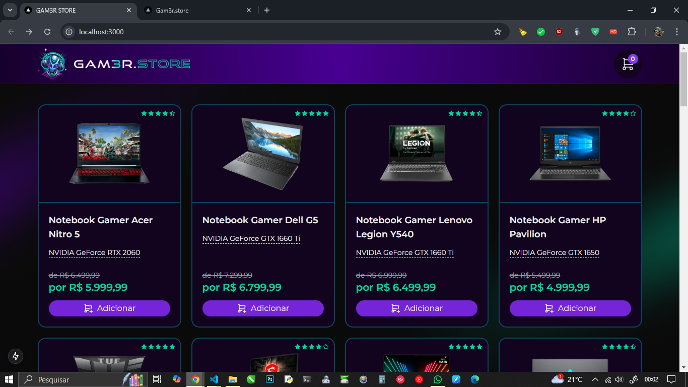</div>

<br>

<div align='center'>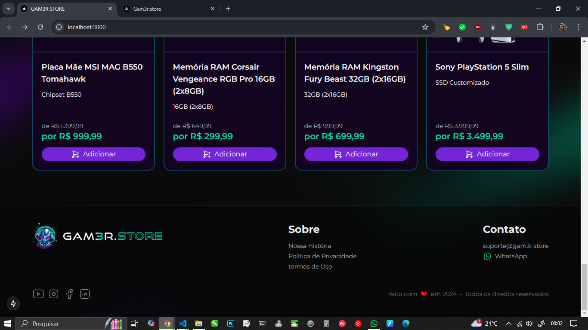</div>

[^ Sumário ^](./README.md)

## Criando Grupo de Rotas

No Next.js, um ***Grupo de Rotas*** ou ***(Route Groups)*** é uma funcionalidade introduzida no ***App Router*** que permite organizar melhor a estrutura das rotas sem impactar diretamente na URL gerada.  

Ele é especialmente útil para:

- ***Agrupar arquivos logicamente:***  
Permite criar subpastas no diretório `app\` para organizar ***componentes*** e ***páginas***, sem que isso altere a estrutura da rota final na URL.

- ***Reutilizar layouts ou componentes:***  
Você pode encapsular páginas ou rotas dentro de ***layouts*** ou ***provedores específicos***, tornando a manutenção e a reutilização mais fáceis.

- ***Ignorar na URL:***  
As pastas de grupos de rotas têm o nome prefixado com entre parenteses `( )`, e isso faz com que sejam ignoradas no caminho final da URL.

***Exemplo:***  
Imagine a seguinte estrutura no diretório ***app\***:

```tsx
// Exemplo

app/
├── (grupo-auth)/
│   ├── login/
│   │   └── page.tsx
│   ├── register/
│   │   └── page.tsx
├── dashboard/
│   └── page.tsx
```

***Nesse caso:***

- As ***rotas*** `/login` e `/register` não terão o prefixo `grupo-auth`.  

- O grupo ***grupo-auth*** pode ser usado para compartilhar um ***layout*** ou ***provedores***, como autenticação.  

***Benefícios:***  

- Organização do código sem poluir a URL.

- Criação de estruturas reutilizáveis.

- Reduz a complexidade no gerenciamento de ***layouts*** e ***contextos***.  

Em nossa aplicação, iremos utilizar o Grupo de Rotas chamado `(paginas)` esse grupo de rotas estará dentro do diretório `app\` e todas as páginas e componentes que estiverem dentro desse Grupo de Rotas irá respeitar o que for definido no ***Componente Layout*** que iremos criar agora.  
Então, no caminho `src\app\` crie o diretório `(paginas)\` e logo depois crie o arquivo `layout.tsx`.

```tsx
// layout.tsx

import Pagina from "../components/template/Pagina";

export default function Layout(props: any) {
  return (
    <Pagina>
      {props.children}
    </Pagina>
  )
}
```

Com isso, não precisamos mais de forma explícita especificar que um Componente está envolvido por uma Página.  
Com isso se formos no caminho `src\app\page.tsx` e remover o Componente `<Pagina>`, ele perderá todo o visual que fizemos até este momento como podemos ver logo abaixo:  

```tsx
// layout.tsx

import { produtos } from '@/core'
import ProdutoItem from './components/produto/ProdutoItem'

export default function Home() {
  return (
    <div className="grid grid-cols-4 container gap-5 py-10">
      {produtos.map((produto) => (
        <ProdutoItem key={produto.id} produto={produto} />
      ))}
    </div>
  )
}
```

<div align='center'></div>

<br>

Como podemos observar acima, foi perdida toda a formatação da Página, já não podemos visualizar mais *(Cabeçalho, background e Rodapé).*

Mas, quando movemos o arquivo `page.tsx` que se encontra no caminho `src\app\` pra o Grupo de Rotas `src\app\(paginas)\`, a mágica acontece e a formatação da página volta a funcionar, pois, tudo que estiver dentro do Grupo de Rotas, irá respeitar as definições do arquivo `layout.tsx`.

***Cabeçalho:***  

<div align='center'></div>
<br>

***Rodapé:***  

<div align='center'></div>

<br>

Movendo o diretório de Produtos para dentro do Grupo de Rotas, ele também será envolvido pelas definições feitas no arquivo ***layout*** do grupo de rotas como podemos ver abaixo o antes e o depois.  

> ### Nota
>
> ___
> Pare o projeto antes de mover o diretório para não demorar nem dar erro, depois inicie novamente `npm run dev` e teste para confirmar que tudo deu certo.  

<br>

***Página do Produto (antes):***  

<div align='center'></div>
<br>

***Página Completa:***  

<div align='center'>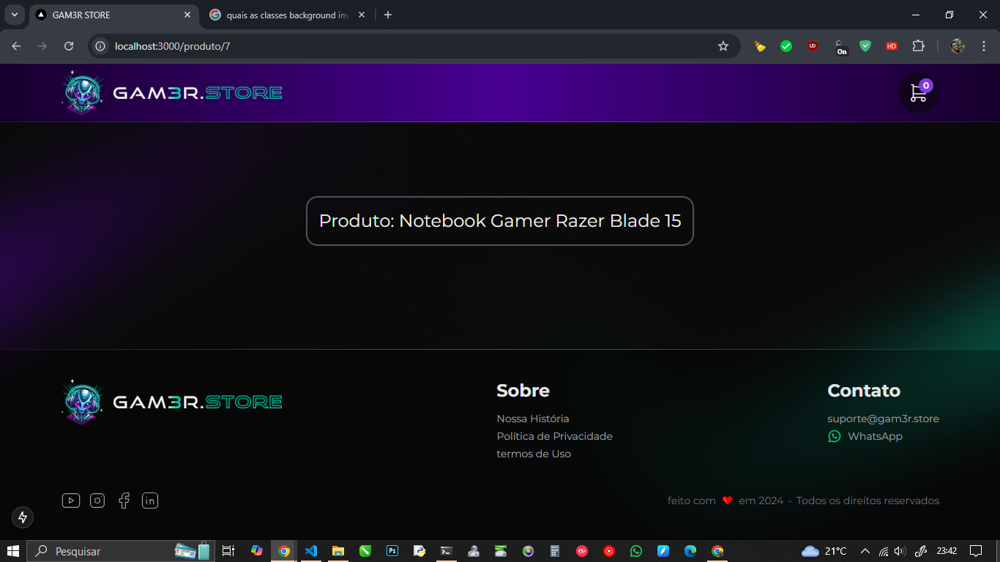</div>

<br>

Como podemos observar no exemplo acima, o Grupo de Rota funcionou e adicionou o Layout a Página do Produto, como esperado.  

[^ Sumário ^](./README.md)

## Criando Componente ListaProdutos

Antes de começar a criar o Componente `<ListaProdutos />` precisamos realizar algumas alterações na Página Inicial.

```tsx
// src\app\(paginas)\page.tsx

import { produtos } from '@/core'
import ProdutoItem from '../components/produto/ProdutoItem'

export default function Home() {
  return (
    <div className="flex flex-col container gap-5 py-10">
      {produtos.map((produto) => (
        <ProdutoItem key={produto.id} produto={produto} />
      ))}
    </div>
  )
}
```

Modificamos de `grid grid-cols-4` para `flex flex-col` pois iremos formatar o grid no novo componente.

Então, no caminho `src\app\components\produto\` crie um novo arquivo `ListaProdutos.tsx`.

```tsx
// ListaProdutos.tsx

'use client'
import { produtos } from '@/core'
// import useProdutos from '@/data/hooks/useProdutos'
import ProdutoItem from './ProdutoItem'
import ProdutoNaoEncontrado from './ProdutoNaoEncontrado'

export default function ListaProdutos() {
  // const { produtos } = useProdutos()
    return produtos.length ? (
      <div
            className="
                grid grid-cols-1 sm:grid-cols-2 md:grid-cols-3 lg:grid-cols-4 gap-5
            "
        >
            {produtos.map((produto) => (
                <ProdutoItem produto={produto} key={produto.id} />
            ))}
        </div>
    ) : (
        <ProdutoNaoEncontrado semBotaoVoltar />
    )
}
```

### Descrição do Componente

O componente **`ListaProdutos`** é responsável por exibir uma lista de produtos ou uma mensagem caso nenhum produto esteja disponível. Ele utiliza as classes do **Tailwind CSS** para criar um layout responsivo, adaptável a diferentes tamanhos de tela.  

Outra coisa que precisamos observar, é que como esse Componente é executado no navegador é necessário adicionar `use client`no inicio do código para que funcione sem causar mensagens de erro.

### Importações Necessárias

```tsx
'use client'
import { produtos } from '@/core'
import ProdutoItem from './ProdutoItem'
import ProdutoNaoEncontrado from './ProdutoNaoEncontrado'
```

- **`produtos`**: Array de objetos representando os produtos disponíveis, importado de `@/core`.
- **`ProdutoItem`**: Componente que exibe as informações detalhadas de cada produto.
- **`ProdutoNaoEncontrado`**: Componente que informa ao usuário que não há produtos disponíveis.

### Estrutura Principal

```tsx
export default function ListaProdutos() {
    return produtos.length ? (
        <div
            className="
                grid grid-cols-1 sm:grid-cols-2 md:grid-cols-3 lg:grid-cols-4 gap-5
            "
        >
            {produtos.map((produto) => (
                <ProdutoItem produto={produto} key={produto.id} />
            ))}
        </div>
    ) : (
        <ProdutoNaoEncontrado semBotaVoltar />
    )
}
```

- **Verificação da Disponibilidade de Produtos**:

  ```tsx
  return produtos.length ? ( ... ) : ( ... )
  ```

  - Verifica se o array `produtos` contém elementos. Se sim, renderiza uma grade de produtos; caso contrário, exibe o componente `ProdutoNaoEncontrado`.

- **Grade Responsiva**:

  ```tsx
  <div
      className="
          grid grid-cols-1 sm:grid-cols-2 md:grid-cols-3 lg:grid-cols-4 gap-5
      "
  >
      {produtos.map((produto) => (
          <ProdutoItem produto={produto} key={produto.id} />
      ))}
  </div>
  ```

  - **Configuração da Grade**:
    - **`grid`**: Configura a lista como uma grade.
    - **`grid-cols-1`**: Configura a grade com 1 coluna no padrão.
    - **`sm:grid-cols-2`**: Expande para 2 colunas em telas pequenas.
    - **`md:grid-cols-3`**: Expande para 3 colunas em telas médias.
    - **`lg:grid-cols-4`**: Expande para 4 colunas em telas grandes.
    - **`gap-5`**: Define um espaçamento uniforme entre os itens da grade.

- **Mapeamento de Produtos**:

  ```tsx
  {produtos.map((produto) => (
      <ProdutoItem produto={produto} key={produto.id} />
  ))}
  ```

  - Itera sobre o array `produtos` e cria um componente `ProdutoItem` para cada item, passando `produto` como prop.

### Exibição de Mensagem Quando Não Há Produtos

```tsx
<ProdutoNaoEncontrado semBotaoVoltar />
```

- Exibe o componente **`ProdutoNaoEncontrado`** com a propriedade `semBotaoVoltar` definida como `true`, indicando que o botão de ***"voltar"*** está desabilitado.

### Resumo

- Quando o array `produtos` contém elementos, o layout será exibido como uma grade configurada pelas classes **Tailwind CSS** mencionadas acima.
- Caso `produtos` esteja vazio, será exibida a mensagem definida no componente **`ProdutoNaoEncontrado`**, sem o botão de voltar.
- A estrutura responsiva garante que o ***layout da grade*** se ajuste de 1 a 4 colunas, dependendo do tamanho da tela do usuário.

[^ Sumário ^](./README.md)

## Criando Componente ProdutoNaoEncontrado

O componente **`ProdutoNaoEncontrado`** é um componente de interface que exibe uma mensagem amigável ao usuário quando nenhum produto é encontrado. Ele inclui um ícone representativo, um texto explicativo e, opcionalmente, um botão para voltar à página inicial.

Então, no caminho `src\app\components\produto\` crie um novo arquivo `ProdutoNaoEncontrado.tsx`.

```ts
// ProdutoNaoEncontrado.ts

import { IconDevicesPcOff } from '@tabler/icons-react'
import Link from 'next/link'

export interface ProdutoNaoEncontradoProps {
    semBotaoVoltar?: boolean
}

export default function ProdutoNaoEncontrado(props: ProdutoNaoEncontradoProps) {
    return (
        <div className="flex-1 flex flex-col justify-center items-center text-violet-300">
            <IconDevicesPcOff size={180} stroke={0.5} />
            <span className="text-violet-300 font-light">Produto não encontrado</span>
            {!props.semBotaoVoltar && (
                <Link href="/" className="button bg-violet-700 text-white mt-5">
                    Voltar
                </Link>
            )}
        </div>
    )
}
```

### Estrutura do Componente

```tsx
export default function ProdutoNaoEncontrado(props: ProdutoNaoEncontradoProps) {
    return (
        <div className="flex-1 flex flex-col justify-center items-center text-violet-300">
            <IconDevicesPcOff size={180} stroke={0.5} />
            <span className="text-violet-300 font-light">Produto não encontrado</span>
            {!props.semBotaoVoltar && (
                <Link href="/" className="button bg-violet-700 text-white mt-5">
                    Voltar
                </Link>
            )}
        </div>
    )
}
```

### Importações Necessárias

```tsx
import { IconDevicesPcOff } from '@tabler/icons-react'
import Link from 'next/link'
```

- **`IconDevicesPcOff`**: Ícone importado da biblioteca **Tabler Icons**.
- **`Link`**: Componente do Next.js para navegação eficiente entre páginas.

### Descrição dos Códigos

1. **Propriedades do Componente**:

   ```tsx
   export interface ProdutoNaoEncontradoProps {
       semBotaoVoltar?: boolean
   }
   ```

   - **`semBotaoVoltar`**: Propriedade opcional (`boolean`) que define se o botão "Voltar" será exibido. Caso seja `true`, o botão é ocultado.

2. **Estrutura HTML e Estilo Principal**:

   ```tsx
   <div className="flex-1 flex flex-col justify-center items-center text-violet-300">
   ```

   - **`flex-1`**: Faz o componente ocupar todo o espaço disponível em um contêiner flex.
   - **`flex flex-col`**: Configura o layout como uma coluna flexível.
   - **`justify-center`**: Centraliza verticalmente o conteúdo dentro do contêiner.
   - **`items-center`**: Centraliza horizontalmente o conteúdo dentro do contêiner.
   - **`text-violet-300`**: Define a cor padrão do texto como um tom de violeta.

3. **Ícone Representativo**:

   ```tsx
   <IconDevicesPcOff size={180} stroke={0.5} />
   ```

   - Utiliza o ícone **`IconDevicesPcOff`** da biblioteca **Tabler Icons**.
   - **`size={180}`**: Define o tamanho do ícone.
   - **`stroke={0.5}`**: Define a espessura do traçado do ícone.

4. **Mensagem de Produto Não Encontrado**:

   ```tsx
   <span className="text-violet-300 font-light">Produto não encontrado</span>
   ```

   - Texto que informa ao usuário que nenhum produto foi localizado.
   - **`font-light`**: Define o peso da fonte como leve.

5. **Botão de Voltar (Opcional)**:

   ```tsx
   {!props.semBotaoVoltar && (
       <Link href="/" className="button bg-violet-700 text-white mt-5">
           Voltar
       </Link>
   )}
   ```

   - **Condição**: O botão só será exibido se `semBotaoVoltar` não estiver definido como `true`.
   - **`Link`**: Componente do Next.js para criar links que otimizam a navegação.
   - **`href="/"`**: Define o redirecionamento para a página inicial.
   - **Classes do Botão**:
     - **`button`**: Classe personalizada (presumivelmente configurada globalmente).
     - **`bg-violet-700`**: Define o fundo do botão como violeta escuro.
     - **`text-white`**: Define a cor do texto como branco.
     - **`mt-5`**: Adiciona uma margem superior para espaçamento.

### Resumo

- **Responsividade**: O layout é responsivo, centralizando o conteúdo na tela.
- **Customização**: A exibição do botão "Voltar" é controlada pela prop **`semBotaoVoltar`**.
- **Aparência**: Utiliza estilos simples e modernos com classes do **Tailwind CSS**.
- **Propósito**: Garante que o usuário receba um feedback visual claro caso não existam produtos disponíveis e, opcionalmente, fornece um botão para facilitar o retorno à página inicial.

[^ Sumário ^](./README.md)

## Listando Produtos na Página Inicial

Agora que já criamos os Componente `<ListaProdutos />` e `<ProdutoNaoEncontra />` podemos utilizar em nossa Página Inicial, então, edite o arquivo `src\app\(paginas)\page.tsx`.

```tsx
// page.tsx

import ListaProdutos from '../components/produto/ListaProdutos'

export default function Home() {
  return (
    <div className="flex flex-col container gap-5 py-10">
      <ListaProdutos />
    </div>
  )
}
```

Remova o `produto.map` que listava os Produtos anteriormente pelo ***Componente ListaProdutos*** e verifique se está sendo exibido corretamente.  

Agora, podemos fazer uma verificação se a Página que exibe o ícone de ***Produto Não Encontrado*** do Componente `ListaProdutos`, podemos fazer uma alteração na lógica para forçar a exibição do ícone, então, edite o arquivo no caminho `src\app\components\produto\ListaProdutos.tsx` no retorno da Função `return produtos.length ? (` altere para `return produtos.length < 0 ? (` e verifique se é exibido o ícone com a mensagem ***"Produto não encontrado"*** como na imagem abaixo.

<div align='center'>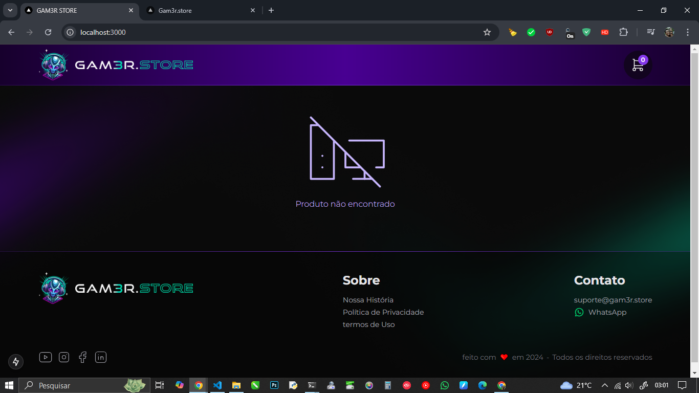</div>

<br>

Agora que já invertemos a ***lógica de exibição*** da Lista de Produtos para poder ver o icone de ***Produto Não Encontrado***, não esqueça de voltar a lógica ao valor correto `return produtos.length ? (` para poder exibir a ***Lista de Produtos***.  

<div align='center'></div>

<br>

1:37
