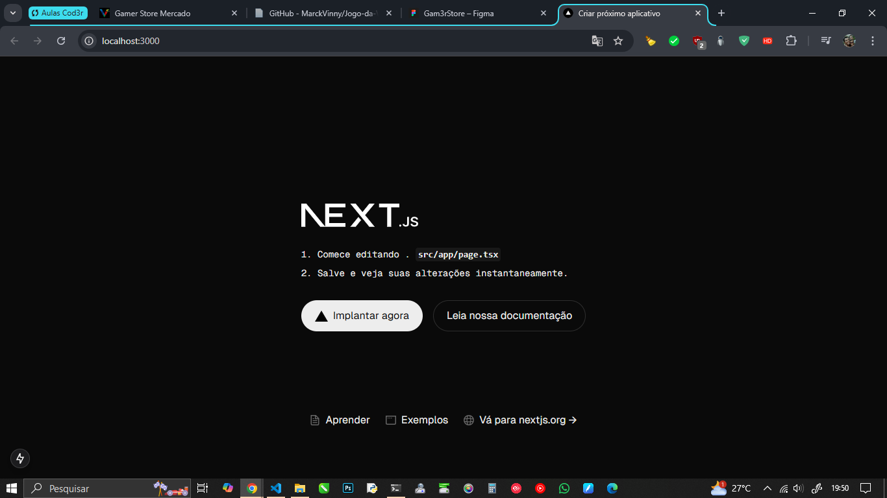
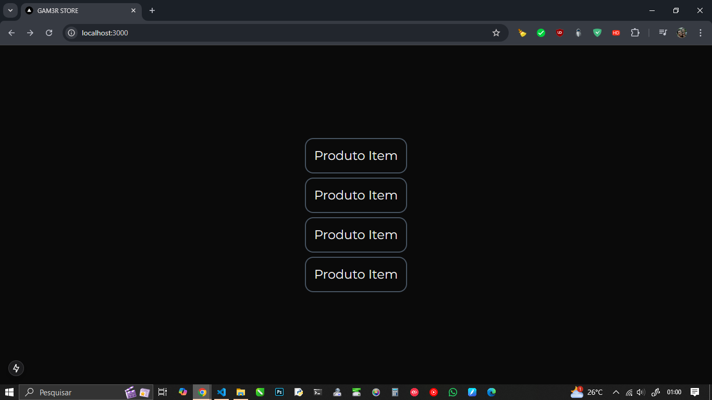

[< voltar](./README.md)

<h1 align='center'>Curso Formação DEV</h1>

***Este conteúdo faz parte do curso de Formação DEV da [COD3R](https://www.cod3r.com.br)***

<h1 align='center'>GAM3R STORE  e-Commerce Simples</h1>

## Criação do Projeto  

Dentro do diretório onde deseja criar o projeto ***"C:\Projetos\ecommerce"*** por exemplo, crie um diretório chamado `\mercado` e dentro desse diretório abra o Terminal e execute o comando a seguir:  

```zsh
// Terminal

$ npx create-next-app@latest frontend
```

Após criar o projeto, instale a dependência [Tabler](https://tabler.io/docs/icons/react#installation) para React que é o pacote de ícones que iremos utilizar no projeto.  
Se houver algum problema na instalação do Tabler, pode ser que o `react:` e o `react-dom:` no `package.json` estejam na versão RC Release Candidate e não sejam compatíveis com o Tabler, a solução é modificar manualmente para uma versão estável, neste momento estamos utilizando a versão 18.3.1.  

```json
// package.json

...
  "dependencies": {
    "@tabler/icons-react": "^3.21.0",
    "next": "15.0.2",
    "react": "^18.3.1",
    "react-dom": "^18.3.1"
...
```

O próximo passo é iniciar o projeto para que possamos visualizar as alterações feitas instantaneamente, para isso execute o comando a seguir no Terminal.  

```zsh
// Terminal

$ npm run dev
```

Com isso teremos o projeto de modelo do React sendo executado no navegador através do endereço [localhost:3000](http://localhost:3000) apresentando a seguinte página:  

<div align='center'></div>

[^ Sumário ^](./README.md)

## Limpando a Estrutura Padrão  

Agora precisamos excluir alguns arquivos e trechos de código que não iremos utilizar em nosso projeto.  

- Primeiro precisamos excluir todo o conteúdo da página principal do projeto que se encontra no caminho `src\app\page.tsx`.  

```tsx
// page.tsx

export default function Home() {
  return (
    <div className="flex justify-center pt-10">Aplicação</div>
  );
}
```

Após a edição do arquivo, ele apresentará no navegador a mensagem ***"Aplicação"*** centralizada na tela.  
O próximo passo é editar o arquivo `layout.tsx` que se encontra no caminho `src\app\layout.tsx`.  

```tsx
// layout.tsx

import type { Metadata } from "next";
import {Montserrat} from "next/font/google"
import "./globals.css";

const font = Montserrat({
  subsets: ['latin']
})

export const metadata: Metadata = {
  title: "GAM3R STORE",
  description: "Versão completa da loja Gam3r.Store",
};

export default function RootLayout({
  children,
}: Readonly<{
  children: React.ReactNode;
}>) {
  return (
    <html lang="pt-BR">
      <body className={font.className}>
        {children}
      </body>
    </html>
  );
}

```

Com isso, fizemos as seguintes alterações:

- Importamos a fonte Montserrat do google.  

  ```tsx
  import {Montserrat} from "next/font/google"
  ```  

- Criamos uma contrante chamada "font" para ser utilizada no body.

  ```tsx
  const font = Montserrat({subsets: ['latin']})
  ```  

- Inserimos a contante "font" no "className" do body.  

  ```html
  <body className={font.className}>
  ```

- Alteramos o idioma da página para português Brasil.  

  ```html
  <html lang="pt-BR">
  ```  

- E por último, modificamos o título e a descrição da página.  

  ```tsx
  export const metadata: Metadata = {
    title: "GAM3R STORE",
    description: "Versão completa da loja Gam3r.Store",
  };
  ```

Com essas alterações, já podemos excluir o diretório `\fonts`que se encontra no caminho `src\app` e todo o conteúdo do diretório `\public` que se encontra na raiz da aplicação.  

>***OBS.:***  
É para excluir o que tem dentro do diretório e não o diretório, a pasta deve continuar na raiz do projeto.

[^ Sumário ^](./README.md)

## Criando o Núcleo da Aplicação

Agora iremos criar o diretório onde iremos criar a ***Regra de Negócio da Aplicação***, neste diretório não será misturado com nenhuma linguagem de framework, aqui iremos utilizar lógica de programação pura, não será desenhado nenhuma tela e nem será feito nenhuma conexão com Banco de Dados ou APIs.  
E é por isso que precisamos aprender a separar o que é Regra de Negócio de frameworks e bibliotecas, para que possamos proteger as Regas de eventuais mudanças que os Frameworks acabam impondo para aqueles que se comprometem demais os utilizando.  
Para isso, no caminho `\src` crie um diretório chamado `\core`, por enquanto ele ficará dentro do Frontend, mas, posteriormente ele será retirado para que fique fora da estrutura do Frontend.  
A Lógica implementada dentro do Core, ficará disponível para toda a aplicação, podendo ser usada tanto no ***Frontend quanto no Backend*** e por outras tecnologias, por isso a importância de se separar a ***Regra de Negócio***.  

Dentro do diretório Core, nenhum arquivo será acessado diretamente, todos os arquivos serão exportados e acessados através do arquivo ***"index.ts"*** que se encontra no caminho `\src\core\index.ts`.  

No ***Core da Aplicação*** iremos definir algumas coisas importantes, principalmente na parte de ***PRODUTOS.***  
No momento nosso foco inicial será ***Página Inicial*** e na página de ***Detalhes de Produtos***, onde constarão as definições do produto, preço com e sem desconto, preço parcelado, botões de comprar e adicionar no carrinho entre outras informações.

[^ Sumário ^](./README.md)

## PRODUTO

### Interface Produto

Estaremos utilizando a abordagem de modelagem por ***interface*** por simplicidade, pois, se optasse-mos por DDD, Arquitetura Limpa e outros padrões que iriam influenciar muito a arquitetura, seria utilizado a abordagem de se criar uma Classe ao invés de uma interface.  
Por isso, vamos focar em uma modelagem mais simples ***"anêmica"***, para poder focar em outras questões da Aplicação, pois, existe muita coisa para ser feita.  

>*Mas aqui seria uma oportunidade de se criar um **Modelo Rico** colocando Regas de Negócio dentro das Entidades, pois, quando as Regras estão no Centro da Aplicação, com as Regras próximas dos DADOS, se favorece uma melhor **Orientação a Objetos.***  
>
>*Pois a **POO** (Programação Orientada a Objetos), diz respeito a Atributos mas também a Comportamentos relacionados aqueles atributos, então, se existem Regras o ideal é que elas andem juntos com os atributos do Objeto, dentro da Classe que está sendo implementada.*
<p>

No caminho `\src\core` crie um novo diretório chamado `\produto` e dentro dele crie um arquivo chamado `Produto.ts` é nesse arquivo que iteremos implementar nossa ***Interface de Produto***, onde iremos definir os atributos do produto.  

```ts
// Produto.ts

export default interface Produto {
  id: number
  nome: string
  descricao: string
  marca: string
  modelo: string
  imagem: string
  nota: number
  videoReview: string
  tags: string[]
}
```

> [!IMPORTANT]
> Não planeje o reuso antes do uso, quero dizer que, não tente criar uma Mega Arquitetura antes de ter a necessidade para aquela Mega Arquitetura, para que não se frustre e desista no meio do caminho.  
>Comece simples e vá evoluindo e implementando conforme o necessário.

[^ Sumário ^](./README.md)

### Interface Especificações

Agora estaremos implementando as Especificações do Produto.
No caminho `\src\core` crie o arquivo chamado `Especificacoes.ts`, esse arquivo tem uma particularidade, pois, diversos produtos possuem especificações diferentes uns dos outros e isso dificulta um pouco na criação dessa Interface, mas existe uma forma de informar essas especificações de uma forma mais flexível.  
Uma coisa é certa, todas as especificações dos produtos e uma delas está em destaque.  

```ts
// Especificacoes.ts

export default interface Especificacoes {
  destaque: string
  //* Faz com que o atributo chave: valor seja flexível
  [chave: string]: string | number | boolean
}
```

Interface Produto atualizada com a adição do atributo especificacoes.

```ts
// Produto.ts

import Especificacoes from "./Especificacoes"

export default interface Produto {
  id: number
  nome: string
  descricao: string
  marca: string
  modelo: string
  imagem: string
  nota: number
  videoReview: string
  tags: string[]
  especificacoes: Especificacoes
}
```

>#### Relação Composição
>
>Quando **TEM UM** Produto **E TEM** Especificações (relação "TEM UM")*
<p>

[^ Sumário ^](./README.md)

### Interface Precificavel

Agora iremos implementar a interface precificavel, isso significa que implementaremos algo que pode ser precificavel.  

No caminho `\src\core` crie o arquivo chamado `Precificavel.ts`, contendo os atributos abaixo.  

```ts
// Precificavel.ts

export default interface Precificavel {
  menorPreco: number
  maiorPreco: number
  precoBase: number
  precoMedio: number
  precoPromocional: number
}
```

A maioria dos programadores gosta de padronizar o nome das variáveis como no caso acima muitos iriam preferir usar o sufixo "preco" em todos os atributos, mas, prefiro particularmente usar variáveis como falamos normalmente, assim fica melhor para identificar sobre o que se trata, utilizando palavras que são usadas regularmente no negócio, evitando assim estranheza por parte de quem vai usar o sistema.  

Pois o código deve refletir ao máximo o negócio, e não ficar usando jargões de tecnologia, dificultando a comunicação entre o corpo técnico e os membros do negócio.  

[^ Sumário ^](./README.md)

### Relação de Herança

Agora iremos implementar uma Relação de Herança na interface Produto, pois, além do produto ter especificações, ele também é precificavel e para estabelecer essa relação, vamos estender a interface produto da interface precificavel, pode parecer difícil, mas é muito simples como podemos ver a seguir.  

```ts
// Produto.ts

import Especificacoes from "./Especificacoes"
import Precificavel from "./Precificavel"

export default interface Produto extends Precificavel {
  id: number
  nome: string
  descricao: string
  marca: string
  modelo: string
  imagem: string
  nota: number
  videoReview: string
  tags: string[]
  especificacoes: Especificacoes
}
```

Neste caso não seria necessário utilizar a Herança, mas foi utilizado para exemplo, pois poderíamos colocar os atributos diretamente na interface Produto.  
A herança seria mais indicado caso existissem outras Entidades que também fossem precificáveis, assim evitaria a duplicação de código desnecessária.  

[^ Sumário ^](./README.md)

### Exportando as Interfaces do Diretório Produto

Agora iremos criar e configurar o arquivo `index.ts` do diretório ***Produto*** presente no caminho `src\core\produto`, nesse arquivo, iremos importar todas as interfaces que implementamos até o momento.  

```ts
// produto\index.ts

import Especificacoes from "./Especificacoes"
import Precificavel from "./Precificavel"
import Produto from "./Produto"

export type {Especificacoes, Precificavel, Produto}
```

Como podemos ver acima, primeiro importamos cada interface utilizando o comando `import` e logo em seguida exportamos as interfaces utilizando o comando `export` seguido de `type`, precisamos utilizar o comando `type` por estarmos exportando uma ***interface*** e não uma ***Classe***.

Agora, por qual motivo que foi criado esse arquivo `index.ts` dentro do diretório Produto?  

Esse arquivo foi criado para que possamos expor todo o conteúdo de Produto para toda a aplicação, mas só criar esse arquivo importando e exportando as interfaces não faz a mágica acontecer, pra isso acontecer verdadeiramente, precisamos criar outro arquivo `index.ts` dentro do diretório Core exportando todo o conteúdo de Produto.  

Esse mesmo processo precisa ser feito em todos os diretórios e arquivos que pretendemos utilizar fora do Núcleo da Aplicação, consequentemente utiliza-los em toda a aplicação.  

Então, vamos criar e configurar o `index.ts` do Core, no caminho `src\core`.

```ts
// core\index.ts

export * from "./produto"
```

Como podemos ver acima, estamos exportando `export` tudo `*` de `from` Produto `"./produto`, esse mesmo procedimento deve ser feito para outros diretórios que pretendemos expor para toda a Aplicação.

[^ Sumário ^](./README.md)

## PARCELAMENTO

No Parcelamento, iremos definir qual é a estrutura de um parcelamento juntamente com o cálculo relacionado a juros compostos (tendo um preço promocional dividido por uma quantidade de parcelas) mostrando qual o valor das parcelas.  
Esta Regra do Negócio continua separada de tecnologias e puramente pertencente ao Núcleo da Aplicação.  

O Parcelamento não estará relacionado ao produto e nem ao pedido, pois, o parcelamento pode ser usado em várias partes da Aplicação.

[^ Sumário ^](./README.md)

### Interface Parcelamento

Agora no caminho `src\core` crie um diretório chamado `parcelamento` e dentro dele crie o arquivo `Parcelamento.ts` que será nossa interface.  

Vamos implementar um interface simples contendo os atributos: valorTotal (que servirá como base para o calculo), valorParcela, qtdeParcelas e taxaJuros.

```ts
// Parcelamento.ts

export default interface Parcelamento {
  valorTotal: number
  valorParcela: number
  qtdeParcelas: number
  taxaJuros: number
}
```

[^ Sumário ^](./README.md)

### Classe Calcular Parcelamento

Agora iremos criar uma Classe que irá implementar o cálculo relacionado ao parcelamento.  

> [!NOTE]
> Esse cálculo, ele é algo que representa a Regra de Negócio da Aplicação e isso não deveria estar ***"amarrado ou atrelado"*** ao Backend, pois, as Regras precisam utilizar apenas a linguagem de programação e dependendo o mínimo possível de Framework, assim se isola a Regra e podemos reusar em qualquer lugar, até mesmo em outra aplicação semelhante.  

<p>

Antes de qualquer coisa precisamos criar o arquivo `index.ts` no diretório chamado `\constants` no caminho `src\core` que irá conter as constantes que iremos precisar usar em nossa ***Classe Calcular Parcelamento***.  

```ts
// constants\index.ts

const QTDE_MAX_PARCELAS = 12
const TAXA_JUROS_MENSAL = 0.0167

export { QTDE_MAX_PARCELAS, TAXA_JUROS_MENSAL }
```

Como podemos ver acima, criamos duas constantes, uma referente a ***quantidade de parcelas*** e a outra referente a ***taxa de juros*** e logo em seguida exportamos as duas constantes para que possamos usar na aplicação.  

Agora que já temos nossas constantes criadas, podemos começar a implementar nossa Classe.  
No caminho `src\core\parcelamento` crie o arquivo `CalcularParcelamento.ts` que será nossa Classe.

```ts
// CalcularParcelamento.ts

import { QTDE_MAX_PARCELAS, TAXA_JUROS_MENSAL } from "../constants";
import Parcelamento from "./Parcelamento";

export default class CalcularParcelamento {
  executar(
    valor: number,  //* Valor Base promocional
    qtdeParcelas: number = QTDE_MAX_PARCELAS,
    taxaJuros: number = TAXA_JUROS_MENSAL //* Pode passar uma taxa específica ou usa a taxa padrão cadastrada
  ): Parcelamento {
    if (qtdeParcelas < 2 || qtdeParcelas > QTDE_MAX_PARCELAS){
      //* Dispara uma exceção caso tem parcelar acima do permitido 
      throw new Error(`Quantidade de parcelas deve ser entre 2 e ${QTDE_MAX_PARCELAS}`)
    }

    //* Calcula o valor total do produto, junto com os juros compostos
    const totalComJuros = this.calcularJurosCompostos(valor, taxaJuros, qtdeParcelas)

    return {
      valorParcela: this.comDuasCasasDecimais(totalComJuros / qtdeParcelas),
      valorTotal: this.comDuasCasasDecimais(totalComJuros),
      qtdeParcelas,
      taxaJuros,
    }
  }

    private calcularJurosCompostos(valorTotal: number, taxaMensal: number, qtdeParcelas: number){
      //* O cálculo é o Valor Promocional, multiplicado pela formula
      //* 1 mais a taxaMensal elevado a qtdeParcelas Ex. (0.0167)¹²
      return valorTotal * Math.pow(1 + taxaMensal, qtdeParcelas)
    }

    private comDuasCasasDecimais(valor: number): number {
      return Math.round(valor * 100) / 100
    }
}
```

O próximo passo é criar o arquivo `index.ts` no diretório `\parcelamento` importando e exportando todos os arquivos constantes nele.  

```ts
// parcelamento\index.ts

import CalcularParcelamento from "./CalcularParcelamento"
import Parcelamento from "./Parcelamento"

export { CalcularParcelamento }
export type { Parcelamento }
```

E para completar o processo, precisamos atualizar o arquivo `index.ts` do diretório `\core` adicionando o diretório `\parcelamento` importando todos os seus arquivos.  

```ts
// core\index.ts

export * from "./produto"
export * from "./parcelamento"
```

[^ Sumário ^](./README.md)

## Banco de Dados Mockado

Para que possamos dar procedimento ao projeto, precisaremos mockar alguns produtos para que possamos exibir nas páginas que iremos criar.  
Posteriormente será executado um processo que irá preencher o banco de dados com essas informações.  

Então no caminho `src\core\constants` crie o arquivo `produtos.ts` e insira os dados ***(não irei colocar todos os daqui aqui pois são muitos, mas constarão no repositório).***

```ts
// produtos.ts

import { Produto } from '../produto'

const produtos: Produto[] = [
  {
    id: 1,
    nome: 'Notebook Gamer Acer Nitro 5',
    descricao:
      'O Acer Nitro 5 é um notebook gamer poderoso, ideal para jogos pesados e multitarefas.',
    marca: 'Acer',
    modelo: 'AN515-54-58CL',
    imagem:
      'https://firebasestorage.googleapis.com/v0/b/formacao-dev.appspot.com/o/lancamentos%2Fgam3rstore%2Facer-nitro-5.png?alt=media&token=094ba6a8-1a4d-414a-b32c-c176bfeaca8e',
    nota: 4.5,
    videoReview:
      'https://www.youtube.com/embed/8NQFr9De3lU?si=s_lN2KTQresD-36Y',
    tags: ['Baixou'],
    precoBase: 6499.99,
    precoPromocional: 5999.99,
    menorPreco: 4850.9,
    maiorPreco: 9800.8,
    precoMedio: 6503.7,
    especificacoes: {
      destaque: 'NVIDIA GeForce RTX 2060',
      Processador: 'Intel Core i5-9300H',
      Memória: '16GB DDR4',
      Armazenamento: '512GB SSD',
      'Placa de Vídeo': 'NVIDIA GeForce RTX 2060',
      Tela: '15.6 polegadas Full HD',
      Peso: '2.5 Kg',
    },
  },
...
]

export default Produtos
```

Agora precisamos atualizar o aquivo `index.ts` do diretório `\constants` adicionando o comando que importar e exportar o nosso Mock do Banco de Dados `produtos.ts`.

```ts
// constants\index.ts

import produtos from "./produtos"

const QTDE_MAX_PARCELAS = 12
const TAXA_JUROS_MENSAL = 0.0167

export { produtos, QTDE_MAX_PARCELAS, TAXA_JUROS_MENSAL }
```

E para finalizar, precisamos atualizar o arquivo `index.ts` no diretório Core da Aplicação `\core` exportando tudo que o diretório `\constants` contém.

```ts
// core\index.ts

export * from "./constants"
export * from "./produto"
export * from "./parcelamento"
```

[^ Sumário ^](./README.md)

## Formatando Moeda

Agora iremos criar uma Classe que irá formatar como a Moeda será exibida na tela.
No caminho `src\core` crie um diretório `\utils` e dentro crie um arquivo `Moeda.ts` que irá conter a implementação da da ***Classe Moeda.***

```ts
// Moeda.ts

export default class Moeda {
  static formatar(
    valor: number,
    localizacao: string = 'pt-BR',
    moeda: string = 'BRL'
  ): string {
    return (valor ?? 0).toLocaleString(localizacao, {
      style: 'currency',
      currency: moeda,
    })
  }
}
```

A Classe acima cria um Método estático chamado `formatar()` com os atributos: valor, localização (que por padrão seleciona o idioma ***'pt-BR'***) e moeda (que por padrão seleciona a moeda ***'BRL'***) e por fim formata a moeda.  

E essa é a Classe Utilitária que iremos utilizar em toda a Aplicação quando formos formatar qualquer moeda.  

Para finalizar, precisamos importar e exportar a Classe Moeda, no arquivo `index.ts` do diretório `\utils`.  

```ts
// utils\index.ts

import Moeda from "./Moeda"

export { Moeda }
```

E para finalizar, precisamos atualizar o `index.ts` do Core da Aplicação exportando todo o conteúdo do diretório `\utils`.

```ts
// core\index.ts

export * from "./constants"
export * from "./parcelamento"
export * from "./produto"
export * from "./utils"
```

Por enquanto o Core da Aplicação está finalizado para que possamos começar e criar a Interface Gráfica da Aplicação, mas, ainda tem bastantes funcionalidades para serem acrescentadas ao Core, mas serão adicionados futuramente.

[^ Sumário ^](./README.md)

## FRONTEND - Interface Gráfica

Agora iremos iniciar a programação da ***Interface Gráfica*** a parte visual da aplicação.  

### Componente ProdutoItem

Inicialmente irenos implementar o ***Item do Produto*** e para isso, vamos criar um Componente chamado ***ProdutoItem***, então, no caminho `src\app` crie um diretório `\components` depois crie outro diretório `\produto` e dentro crie o arquivo `ProdutoItem.tsx`.  

Como puderam notar, agora estamos usando a extensão ***".tsx"*** ela possui um "x" no final pois estaremos criando página Rect que mistura o ***"html"*** e o ***"css"*** na criação da interface gráfica, ou seja, um arquivo typescript possui código html e css dentro dele.

> ***NOTA:***
> ___
> *Um atalho no VSCode para criar essa estrutura mais rápido é ao invés de criar uma pasta de cada vez e depois criar o arquivo, pode clicar em criar arquivo e digitar: `components\produto\ProdutoItem.ts`.  
Assim, já são criadas as pastas e o arquivo com um único clique.  
**PS.: lembrando que para esse exemplo precisa estar dentro do** `\app`.*
<p>

Para iniciar e poder começar a visualizar algo na tela, vamos criar uma Função que irá exibir uma DIV contendo o texto ***"Produto Item"***, somente isso por enquanto.  

```tsx
// ProdutoItem.tsx

export default function ProdutoItem () {
  return (
    <div className="text-2xl border-2 border-gray-600 rounded-2xl p-4">
      Produto Item
    </div>
  )
}
```

No Componente ProdutoItem, O texto ***"Produto Item"*** será grande *(tamanho 2xl)*, estará dentro de uma div com bordas de 2 pixels de espessura, uma cor cinza escura e bordas arredondadas *(2xl)*.
O conteúdo dentro da div terá um espaçamento interno *(padding)* de 1rem *(16px)*, garantindo que o texto não fique colado nas bordas da div.  

- `text-2xl`:  
***Função:*** Define o tamanho do texto como 2xl *(extra grande)*.  
***Tamanho:*** Aproximadamente 1.5rem *(24px)* por padrão no Tailwind CSS.  
***Exemplo:*** Aumenta o tamanho da fonte do texto ***"Produto Item"***.  

- `border-2`:  
***Função:*** Aplica uma borda ao redor da div com uma largura de 2 pixels.
***Exemplo:*** A borda em volta da div terá 2 pixels de espessura.  

- `border-gray-600`:  
***Função:*** Define a cor da borda como cinza escuro.  
***Escala:*** gray-600 é uma cor da paleta de cinza do Tailwind, e é uma tonalidade intermediária de cinza.  
***Exemplo:*** A borda ao redor da div terá uma cor de cinza escuro.  

- `rounded-2xl`:  
***Função:*** Define o arredondamento das bordas como 2xl.  
***Significado:*** Isso aplica bordas arredondadas com um raio maior *(aproximadamente 1rem ou 16px de raio de curvatura)*.  
***Exemplo:*** As bordas da div terão cantos arredondados de forma mais pronunciada.  

- `p-4`:  
***Função:*** Aplica um padding (espaçamento interno) de 1rem (16px) em todos os lados da div.  
***Exemplo:*** O conteúdo "Produto Item" ficará afastado das bordas da div, com 1rem de espaço por todos os lados.  

Agora que temos o Componente ProdutoItem criado, podemos adiciona-lo a página principal da aplicação, e para isso abra o arquivo `page.tsx` no caminho `src\app` e faça as alterações abaixo.  

```tsx
// Page.tsx

import ProdutoItem from "./components/produto/ProdutoItem";

export default function Home() {
  return (
    <div className="flex flex-col items-center justify-center space-y-2 h-screen">
      <ProdutoItem />
      <ProdutoItem />
      <ProdutoItem />
      <ProdutoItem />
    </div>
  );
}
```

Acima temos a página inicial de nossa aplicação renderizando 4 Componentes `<ProdutoItem />` eles serão exibidos centralizados na tela com um espaçamento de 2px entre eles.  

A div que envolve os componentes ***ProdutoItem*** usará o Flexbox para organizar os itens em uma coluna, centralizá-los tanto vertical quanto horizontalmente na tela.  

Entre os itens ***ProdutoItem***, haverá um pequeno espaçamento *(8px)* definido por `space-y-2`.  

A div ocupará toda a altura da tela *(h-screen)*, e os itens serão alinhados ao centro, tanto na vertical quanto na horizontal, abaixo o que cada ClassName faz:  

- `flex`:  
***Função***: Define que o contêiner usará o modelo de layout Flexbox.  
***Exemplo***: O Flexbox ajuda a organizar e alinhar os itens filhos *(os componentes ***ProdutoItem***)* de maneira eficiente e controlada.  

- `flex-col`:  
***Função***: Organiza os itens filhos na direção vertical *(coluna)*.  
***Exemplo***: Os componentes ***ProdutoItem*** serão empilhados um abaixo do outro, formando uma coluna.  

- `items-center`:  
***Função***: Alinha os itens filhos horizontalmente no centro do contêiner *(ao longo do eixo transversal do Flexbox).*  
***Exemplo***: Todos os ***ProdutoItem*** serão centralizados horizontalmente dentro da div.  

- `justify-center`:  
***Função***: Alinha os itens filhos verticalmente no centro do contêiner *(ao longo do eixo principal do Flexbox).*  
***Exemplo***: Todos os ***ProdutoItem*** serão centralizados verticalmente dentro da div.  

- `space-y-2`:  
***Função***: Adiciona um espaçamento vertical de *0.5rem (8px)* entre os itens filhos *(no caso, entre os componentes ***ProdutoItem***).*  
***Exemplo***: Cria um pequeno espaço entre cada um dos componentes ***ProdutoItem*** na lista.  

- `h-screen`:  
***Função***: Define a altura do contêiner como 100% da altura da viewport *(tela visível)*.  
***Exemplo***: A div que contém os componentes ***ProdutoItem*** ocupará toda a altura da tela, ajudando a centralizar verticalmente os itens dentro dessa área.  

Essas classes trabalham juntas para criar uma estrutura bem organizada e visualmente equilibrada, com centralização dos itens e uma estética agradável com bordas arredondadas e espaços internos adequados e podemos verificar como ficou, na imagem a seguir:  

<div align='center'></div>

